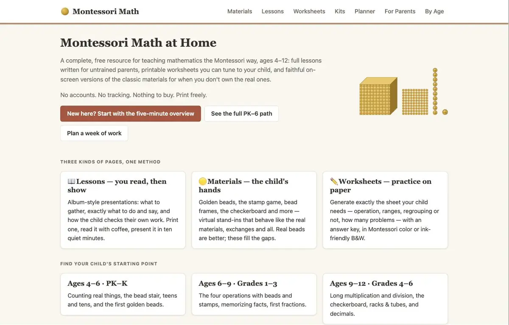
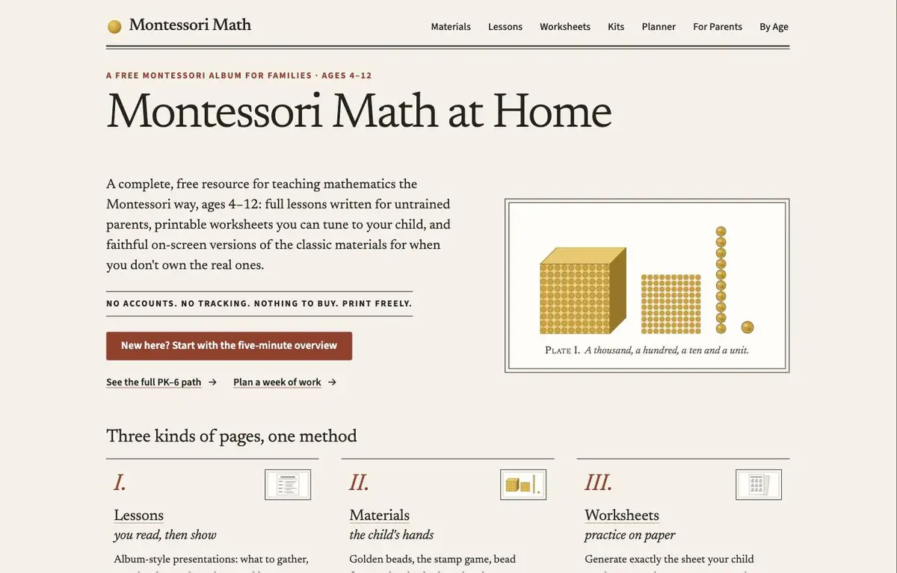
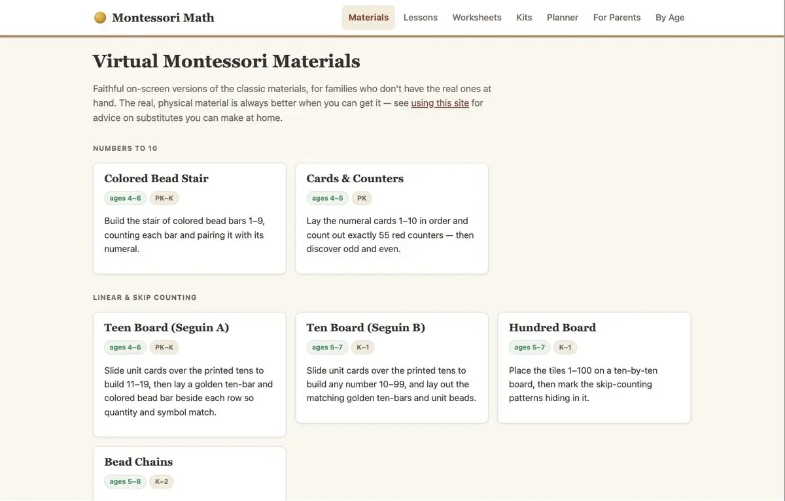
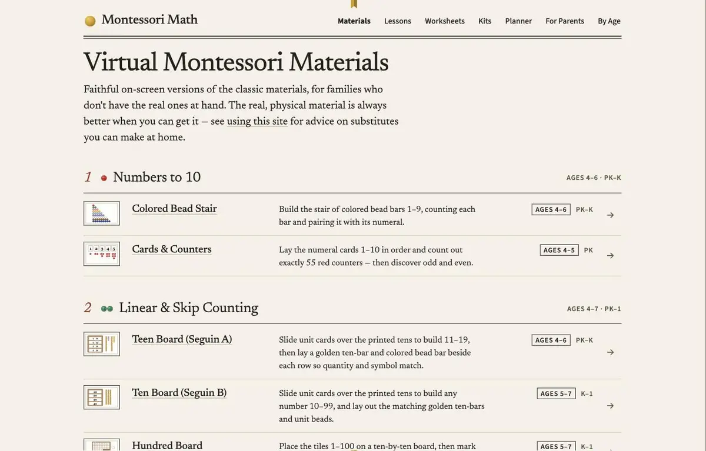
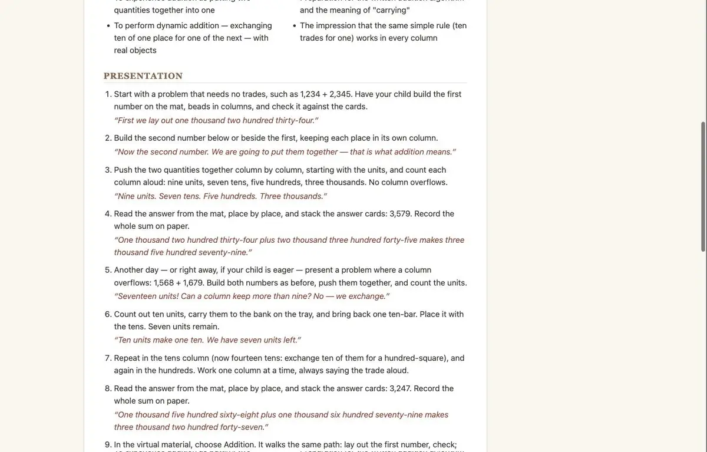
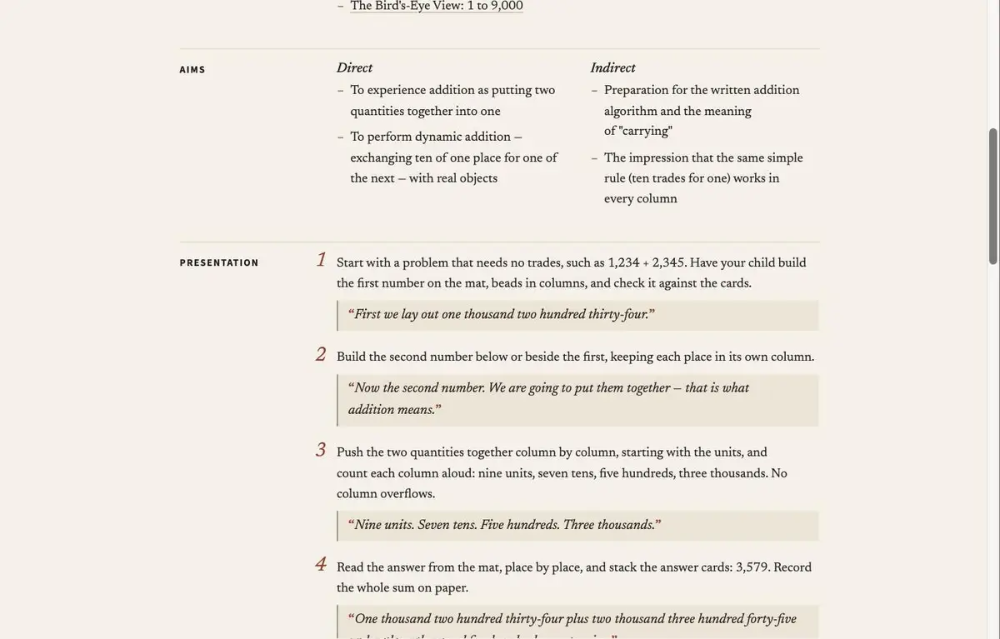

# PRD 19 — The Album: visual redesign

**Status:** Not started
**Effort:** L — about 9 working days. The prototype's estimate for the re-skin, the 21 plate thumbnails and print QA is 7–8 days; running the print gate on every phase and testing on a real iPad, phone and B&W laser printer add about one more.
**Depends on:** PRDs 00–18 (all Done; 16 was removed). The four functional fixes from the separate bug-fix session are merged to `main` (PR #7: `84ff957`, `e24aa01`, `477ac70`, `dbe71b6`), and so is an error boundary around the routed page (PR #8: `d769872`), which Step 12 keeps. Step 1 tags the print baseline on that `main`, and Step 39 is written against the post-fix `BuilderPage.tsx`.

## Why

A page-by-page visual audit in September 2026 rendered all 97 routes in Chrome at desktop, tablet and phone widths, and checked every printable. The site works and its content is good, but it looks like a generic blog template. The audit's diagnosis:

- **No type scale.** h1 is 32px, h2 24px, body 16px, and every heading is Georgia at a faux-bold 600. About 14 near-duplicate text sizes read as one grey mid-size. The home title has no more presence than the glossary's.
- **Too much grey.** Intros and ledes, the text meant to hook a parent, are the lightest text on the page. The only divider between strands on the index pages is a 12.5px grey caps label.
- **One white card for everything.** Index tiles, the album page, the builder form, notes and help boxes share one washed-out surface. The worksheet preview is white on white, so the "sheet of paper" is lost.
- **Left-pinned measures.** Inline `maxWidth: '46rem'` styles pin lessons, guides and notes to the left of an 1100px box, leaving the right third of a desktop screen empty.
- **No imagery in navigation.** The site is about tactile materials, and it lists them as text in ragged card grids, most of which end in a half-empty row.
- **No shared page-header pattern.** Print sits somewhere different on every page type.
- **Generic chrome.** A white header bar, a two-paragraph footer, and emoji icons glued to their labels.

The Album treats the site as a well-made book: a Montessori teacher's album that happens to live on screen. Pages are warm paper and text is near-black ink. A book serif (Newsreader) sets everything you read, and a plain sans (MM Sans, a renamed subset of Source Sans 3) sets everything you operate. Fine rules replace boxes. Chapters are numbered, lesson steps are set like a printed album, and every index reads like a table of contents with a small mounted plate of each material.

Colour belongs to the materials. The golden beads, the place-value green, blue and red, and the bead stair become the brightest things on every page. The chrome adds only a golden silk ribbon, a three-bead fleuron and one rubric red for numerals, quote marks and the page's single primary action. A lesson on screen and the same lesson on paper look like one object. Worksheets, kits and the planner print exactly as they do now.

These screenshots come from the working prototype, which re-skinned the live pages (see [Reference assets](#reference-assets)).

**Home**, before and after:





**Materials index**, before and after:





**Lesson steps**, before and after:





The audit's full report is private. Everything this PRD needs from it is in [19-the-album/audit-findings.md](19-the-album/audit-findings.md): all 165 verified findings, each marked as resolved by a step here, fixed in the bug-fix session, or left as a candidate for PRD 20.

## Owner decisions (locked 2026-09-29)

1. **Direction.** The Album, chosen over two other directions after a panel scored all three for parents and Montessori authenticity, visual craft, and feasibility under the hard rules.
2. **Fonts.** Self-host Newsreader (reading and display) and Source Sans 3 (UI) as woff2 files in `public/fonts/`, under the SIL Open Font License 1.1, precached by the service worker. The approved budget is about 148 KB; the build in Step 2 measures 116.6 KB, with a hard 200 KB cap in Step 4. Source Sans 3 declares "Source" as a Reserved Font Name, so the modified subset ships renamed **MM Sans**. Only Newsreader roman is preloaded. There is no font CDN and no `@import`.
3. **Print.** Lessons and guides print in the album design: running head, margin heads and hung numerals. That change requires page-break QA on the longest lessons and a test on a black-and-white laser printer (Steps 34 and 38). Worksheets, kits and planner printables stay computed-style identical in print, in colour and with `bw=1`. The print gate (Step 1) proves it on every phase.
4. **Primary buttons are rubric.** The home call to action, every Print button and the builder's primary action are rubric red `#9a3b27` with `#fffdf8` text, 6.82:1.
5. **Scope.** PRD 19 is the visual system and the page chrome only. Audit findings about how materials render and what printables contain are candidates for PRD 20. The four functional bugs are fixed in the separate session and are out of scope here: the Hundred chain crash, the blank "Print control charts", number fields clamping each keystroke, and the answer-key number glued to its operand.

## Binding product rules

From `CLAUDE.md`, restated as they bind this work:

1. **No accounts, tracking or gamification.** Nothing new is stored. The only new state is ephemeral UI: the planner's "Link copied" status and the nav's scroll position on phones. No localStorage, no praise animation, no progress.
2. **Practice happens on paper.** No new on-screen child activity. The materials behave exactly as before.
3. **Print is first-class, and colour never carries information alone.** The print gate keeps every worksheet, kit and planner printable identical, in colour and B&W. Lessons and guides print in the new design and must read cleanly on a B&W laser. In the chrome, meaning always has a non-colour cue: the active nav link is bold, the age is a boxed stamp, spoken lines are italic with quote marks and an indent, disabled controls are dashed, and links are underlined.
4. **Fully static and offline.** The fonts are same-origin files in `public/fonts/`, precached by the service worker. The prototype's Google Fonts `@import` is a mock-only stand-in and never ships. No runtime request leaves the origin.
5. **No new npm dependencies.** The fonts are built once with fontTools, a Python tool installed outside the repo, and the print gate is a console script. Runtime dependencies stay `react`, `react-dom` and `react-router-dom`, and `package.json` does not change.
6. **Montessori authenticity.** Material tokens (`--pv-*`, `--bead-*`, `--golden*`, `--felt`, `--wood`, `--wood-dark`, `--inset-frame`, `--fraction-shade`) are never re-pointed, and no material component's own rendering is edited. The token shield (Step 5) hands the old chrome values back to every material stage and printable sheet. The plate thumbnails are drawn with the real bead primitives and colour rules, and Plate I shows the golden beads in true proportion.
7. **Plain CSS and tokens.** Colours come only from CSS variables defined in `tokens.css`. No TSX file has a colour literal. Print rules may use `#000`, as `print.css` already does. No `:has()`, no `[style]` attribute selectors, no CSS-generated captions, and no JavaScript DOM surgery: the prototype's shortcuts all become real classes and markup.
8. **TypeScript strict with `verbatimModuleSyntax`.** Type-only imports use `import type`. Tests are colocated, run in Vitest's node environment, and test pure logic, never React rendering.
9. **Access.** Every chrome control is at least 44px (`--touch-target`), keeps a visible 3px focus ring, and meets WCAG AA contrast (measured ratios below). Every chrome transition and animation respects `prefers-reduced-motion`.
10. **One session, not parallel agents.** This PRD edits shared files (`tokens.css`, `global.css`, `main.tsx`, `index.html`, `MaterialShell.tsx`, `PrintButton.tsx`, the layout), so per `CLAUDE.md` one session implements it in order.
11. **Workflow.** Commit per phase with a clear message, so the history tells the story. Ask the owner before any scope change. "Stop" means stop.

## The visual system at a glance

### Tokens

All values live in `src/styles/tokens.css` (Step 6).

| Token | Value | Role |
|---|---|---|
| `--paper` | `#f6f1e7` | The album page (body background). `index.html`'s theme colour and the web manifest mirror it. |
| `--paper-warm` | `#ede5d5` | Quiet fills: the hover wash, the planner shelf, the band behind spoken lines |
| `--desk` | `#e2d9c7` | The desk a printable sheet lies on in previews (screen only) |
| `--card` | `#fffdf8` | Card stock: plates, buttons, fields, Plate I, the walk-through step card |
| `--ink` | `#26221d` | Letterpress black: text, rules, button edges |
| `--ink-soft` | `#5e5548` | Meta text only: badges, help lines, kind labels |
| `--line` | `#d6ccb8` | Hairlines between entries. Decorative: never a control's only edge |
| `--line-strong` | `#8c816f` | Field borders, the spoken-line rule, faint underlines in the scope chart |
| `--accent` | `#9a3b27` | Rubric: step and chapter numerals, quote marks, the one primary action |
| `--accent-dark` | `#7a2d1d` | Rubric hover and pressed |
| `--on-accent` | `#fffdf8` | Text on rubric |
| `--link-rule` | `#a8705f` | The underline under ink link text (the underline, not the colour, is the cue, so it clears 3:1) |
| `--oxford-under`, `--oxford-over` | a 2px ink rule over a 1px ink rule, 2px apart (background gradients) | Under the running head, over the colophon, under a lesson title. Backgrounds don't print, so print uses a 3px double border |
| `--fleuron` | three radial-gradient golden beads, 44×12px | The section-break ornament |
| `--focus` | `#1e6bb8` (unchanged) | The 3px focus ring |
| `--golden*`, `--pv-*`, `--bead-*`, `--felt`, `--wood`, `--wood-dark`, `--inset-frame`, `--fraction-shade` | unchanged | Material colours. The chrome borrows golden only for the silk ribbon, the fleuron and `::selection` |
| `--mat-*` | the pre-PRD-19 chrome values | The source of the token shield |
| `--chrome-*` | the chrome values, resolved at `:root` | Twins for chrome drawn on or inside a shielded element |

The legacy names `--radius` and `--radius-sm` now alias 2px, `--shadow-sm` is a transparent zero shadow, and `--shadow-md` is the sheet shadow. That flattens the old card chrome before later steps restyle it.

### Type

| Token | Value | Use |
|---|---|---|
| `--font-text` | `'Newsreader', 'Newsreader Fallback', Georgia, 'Times New Roman', serif` | Everything you read, and titles. `--font-heading` and `--font-body` alias it in the chrome |
| `--font-ui` | `'MM Sans', 'MM Sans Fallback', system-ui, -apple-system, 'Segoe UI', Roboto, sans-serif` | Everything you operate: nav, buttons, fields, labels, meta, tables |
| `--font-numeral` | `Georgia, 'Times New Roman', serif` | Number-card and stamp figures inside materials (unchanged look) |
| `--font-material` | `system-ui, -apple-system, 'Segoe UI', Roboto, 'Helvetica Neue', sans-serif` | The legacy body face the shield gives back to stages and sheets |

| Step | Token | Size | Use |
|---|---|---|---|
| 1 | `--fs-caps` | 0.875rem (14px) | Sans capitals: margin heads, labels, meta, kickers |
| 2 | `--fs-ui` | 1rem (16px) | Nav, buttons, fields, help, tables |
| 3 | `--fs-read-sm` | 1.0625rem (17px) | Summaries, notes, captions |
| 4 | `--fs-body` | 1.125rem (18px) | Reading text (the body) |
| 5 | `--fs-lede` | 1.3125rem (21px) | Ledes, entry titles, h3 |
| 6 | `--fs-h2` | 1.75rem (28px) | Chapter and section heads |
| 7 | `--fs-h1` | `clamp(2.25rem, 1.6rem + 1.9vw, 3.25rem)` (36–52px) | Page titles, weight 400 (lesson titles 350) |
| 8 | `--fs-display` | `clamp(2.75rem, 1.4rem + 4.6vw, 4.75rem)` (44–76px) | The home title only, weight 350 |

`--measure` is 40rem, about 70 characters at 18px. The weights on offer are Newsreader roman 350–600, Newsreader italic 400–500 and MM Sans 400–700. Chrome headings get `text-wrap: balance` and chrome paragraphs `text-wrap: pretty`.

### Space, shape and layout

| Token | Value |
|---|---|
| `--space-1` … `--space-8` | 0.25, 0.5, 0.75, 1, 1.5, 2.25, 3, 4.5rem |
| `--radius-chrome` | 2px (paper corners) |
| `--radius-control` | 3px (buttons) |
| `--shadow-sheet` | `0 1px 1px rgba(38, 34, 29, 0.12), 0 18px 36px -14px rgba(38, 34, 29, 0.45)` (paper lifting off the desk) |
| `--container` | `min(1068px, calc(100% - 2rem))`; `calc(100% - 32px)` at ≤640px (16px gutters). Screen only |
| `--margin-col` | 11rem: the margin column for album and guide heads; 0 at ≤640px |
| `--gutter` | 2.75rem between the margin column and the text; 0 at ≤640px |

### Contrast

Measured with the WCAG 2.x formula against the surface named.

| Pair | Ratio | Where |
|---|---|---|
| ink on paper, paper-warm, card | 14.04, 12.62, 15.54 | All text, rules, button edges (WCAG 1.4.11: 14.04) |
| ink on desk | 11.27 | Nothing on the desk is text; for reference |
| ink-soft on paper, paper-warm, card | 6.50, 5.85, 7.20 | Meta, help, kind labels, toolbar labels |
| rubric on paper, card, paper-warm | 6.16, 6.82, 5.54 | Numerals, quote marks, hover titles |
| on-accent on rubric | 6.82 | Every primary button (Print, home CTA) |
| on-accent on accent-dark | 9.30 | Primary hover |
| accent-dark on paper | 8.40 | Rubric pressed |
| `--line-strong` on card, paper, paper-warm | 3.77, 3.40, 3.06 | Field borders (WCAG 1.4.11 needs 3:1) |
| `--link-rule` underline on paper, paper-warm, card | 3.62, 3.26, 4.01 | The only thing that marks an ink link as a link (WCAG 1.4.11 needs 3:1) |
| focus ring on paper, paper-warm, card | 4.84, 4.36, 5.37 | The 3px `--focus` ring |
| unchecked checkbox edge (UA `#767676`) on paper, paper-warm | 4.03, 3.63 | Checkboxes |
| ink on golden-light | 9.88 | `::selection` |
| age stamp: ink on paper | 14.04 | Was green on a green tint, 3.80:1 (S1-23) |
| scope-chart strand rows: ink on paper | 14.04 | Was white on wood, 3.1:1 (S8-03) |

`--line-strong` is deliberately darker than the prototype's `#9c907c`, which gave 2.79:1 on paper and 2.51:1 on paper-warm and failed WCAG 1.4.11 for field borders. `--link-rule` is darker than the prototype's `#c79a8b` for the same reason: at 2.21:1 on paper (1.99:1 on paper-warm) the only cue on an ink link fell below 3:1.

### The token shield

Re-skinning the chrome must not change a single material or printout, and both read the same token names the chrome does. The shield solves this in `tokens.css`:

- The pre-PRD-19 chrome values are kept as `--mat-*` source tokens.
- On every `.material-stage` and every `.print-sheet`, the 17 chrome tokens that material and print CSS read (`--paper`, `--paper-warm`, `--card`, `--ink`, `--ink-soft`, `--line`, `--accent`, `--accent-dark`, `--on-accent`, `--radius`, `--radius-sm`, `--shadow-sm`, `--shadow-md`, `--font-heading`, `--font-body`, `--font-text`, `--font-ui`) are pinned back to those values.
- A zero-specificity rule resets the text metrics a stage or sheet would inherit from the new body (font family, 1rem, line-height 1.55, and ink colour on the stage).
- Material tokens are never listed, because they are never re-pointed.

Two small additions complete it. **Chrome twins** (`--chrome-paper`, `--chrome-ink` and so on) are resolved at `:root` and keep the chrome value inside a shielded element; the plate mount drawn on `.material-stage` (Step 28) uses them. **The shield exception** `.print-sheet .no-print` hands the chrome values back to control bars that sit inside a sheet preview but never print (the chart materials' print bars), so their Print button is rubric.

The shield is installed while every value is still the old one (Step 5), and only then are the chrome tokens re-pointed (Step 6). The stage gates and the print gate prove it: 0 computed-style differences inside all 21 stages at 1400px and 19 at 390px, and in every printable.


## Conventions every step follows

The steps below rely on these rules. Each one is defined by an early step and then assumed by every later one.

1. **The chrome guard.** Any chrome rule written as an *element* selector (h1–h4, p, li, dd, a), or on a class that also appears inside materials (`.btn`), ends in `:where(:not(.material-stage *, .print-sheet *))`. `.btn` uses `:where(:not(.material-stage *))` only, because the print bars inside sheet previews are chrome. The guard adds no specificity. The legacy element rules stay in place above the guarded rules and still style everything inside a stage or sheet. Rules on chrome-only classes (`.page-header`, `.contents-row`, `.album …`) don't need the guard.
2. **The token shield** (Step 5) pins 17 legacy chrome tokens on `.material-stage` and `.print-sheet`, and resets their `font-family`, `font-size` and `line-height` (plus `color` on the stage). Never re-point `--pv-*`, `--bead-*`, `--golden*`, `--felt`, `--wood`, `--wood-dark`, `--inset-frame` or `--fraction-shade`.
3. **Chrome twins.** Inside a shielded element, `--paper`, `--ink` and the other pinned names hold the *legacy* values, and that includes the stage element's own properties. Chrome drawn on or inside a shielded element uses the twin instead: `--chrome-paper`, `--chrome-ink`, `--chrome-line`, `--chrome-accent` and so on (Step 6). For example, the plate mount that Step 28 draws with inset box-shadows on `.material-stage` must use `var(--chrome-ink)` and `var(--chrome-paper)`, or it comes out in the old colours.
4. **Containers around a stage or sheet** (`.material-shell`, `.material-plate`, `.builder-preview`, `.sheet-preview`, `.planner-preview`) may set `font-family`, `font-size`, `line-height` and `color`, because the shield resets those. They must not set any other inherited text property (`letter-spacing`, `font-style`, `font-weight`, `text-transform`, `text-wrap`, `font-variant*`, `font-feature-settings`). Any of those would leak into materials and printouts.
5. **No blanket UI-font rule.** The prototype's `:where(button, select, input, textarea, label, summary, table):not(...) { font-family: var(--font-ui) }` is not carried over. `.btn` and `.badge` set `var(--font-ui)` themselves (Steps 9 and 11). Every other chrome container that holds controls sets `font-family: var(--font-ui)` itself: the nav, the material toolbar, fields, tables, panels.
6. **Motion.** Every chrome `transition` or `animation` is declared inside `@media (prefers-reduced-motion: no-preference)`, so a reader who asks for less motion gets instant state changes and no movement.
7. **Font weights on offer.** Newsreader roman 350–600, Newsreader italic 400–500, MM Sans 400–700. A weight outside a face's range draws at the nearest weight inside it. Newsreader has no small caps (`font-variant: small-caps` is synthesised) and no arrow glyphs (→ falls back per glyph). MM Sans has no italic (it is slanted synthetically).
8. **Icons.** Use `<Icon name="…" />` from `src/components/Icon.tsx` (Step 8). A control that shows an icon keeps its text as the accessible name. The button pattern is `<button className="btn has-icon"><Icon name="print" /><span className="btn-label">Print</span></button>`. The guard test from Step 10 fails if an emoji appears anywhere in `src/`.
9. **Stylesheet order.** After Steps 3, 12, 15 and 16, `src/main.tsx` imports, in this order: `fonts.css`, `tokens.css`, `global.css`, `layout.css`, `contents.css`, `forms.css`, `print.css`, then the existing `materials.css`, `album.css`, `worksheets.css`, `guides.css`, `planner.css` and `presentation.css`. Print rules still load after every screen rule they override, and the page stylesheets (`materials.css`, `album.css`, `guides.css`) refine the shared ones on order. Don't reorder the existing imports: audit finding S6-01 (a PRD 20 candidate) depends on today's order.
10. **Line numbers.** Every quoted line number refers to the file at `album-baseline`: `main@0faa268` plus the four bug-fix commits. Earlier steps in this PRD shift lines, so always find the code by the quoted text; the numbers are only a guide. Where the bug-fix commits moved a line, both numbers are given.
11. **No inline styles on pages.** Page components style through classes. The only `style={{…}}` props allowed outside the material, generator and kit components (which this PRD doesn't touch) are the logo gradient's `stopColor` in `Layout.tsx`, the SVG paint and numeral font styling in `MaterialThumb.tsx` (token values for colour and family, plus the numerals' `fontWeight: 700`) and `SheetPreview`'s measured `zoom`.
12. **The gates.** "The print gate PASSes" means: with the PRD branch on the dev server, run `await printGate.run({ label: 'after' })` and then `await printGate.compare('before', 'after')`, and the console prints `PRINT GATE PASS`. "The stage gate PASSes" means both stage suites pass: `run({ label: 'stages-after', suite: 'stages' })` with `compare('stages-before', 'stages-after')` (1400px), then `run({ label: 'stages390-after', suite: 'stages390' })` with `compare('stages390-before', 'stages390-after')` (390px), and the console prints `STAGE GATE PASS` both times. Step 1 records the `before`, `stages-before` and `stages390-before` baselines once and explains the procedure.

### The shield probe

The gates are the full check. The shield probe is the quick one for a single page, used by several **Check:** lines. Paste it into the DevTools console on the page under test. It copies one line per element inside every stage and sheet to the clipboard, and skips `.no-print` subtrees because they never reach paper. The stage box's own corner radius and box-shadow are the plate mount that Step 28 draws on it (chrome, not material), so the probe records them as `(mount)`, as the stage gate does.

```js
(() => {
  const P = ['font-family', 'font-size', 'font-weight', 'font-style', 'line-height', 'letter-spacing', 'text-transform',
    'color', 'background-color', 'border-top-color', 'border-top-width', 'border-top-left-radius', 'box-shadow',
    'padding-top', 'margin-top']
  const MOUNT = ['border-top-left-radius', 'box-shadow'] // the stage's own plate mount (Step 28)
  const rows = [...document.querySelectorAll('.material-stage, .material-stage *, .print-sheet, .print-sheet *')]
    .filter((e) => !e.closest('.no-print'))
    .map((e) => {
      const s = getComputedStyle(e), r = e.getBoundingClientRect()
      const mount = e.matches('.material-stage')
      return `${e.tagName}.${e.getAttribute('class') ?? ''} ${r.width.toFixed(1)}x${r.height.toFixed(1)} ` +
        P.map((p) => (mount && MOUNT.includes(p) ? '(mount)' : s.getPropertyValue(p))).join(' | ')
    })
    .sort()
  copy(rows.join('\n'))
  return `${rows.length} rows copied`
})()
```

**Procedure.** Run it on `album-baseline` and paste the output into `before.txt`. Apply the step, reload, run it again and paste into `after.txt`. `diff before.txt after.txt` must print nothing.

- Screen probes use a 1400px-wide window.
- Print probes use DevTools › Rendering › "Emulate CSS media type: print", with the window 720px wide.
- Worksheet URLs pin the seed, e.g. `?seed=424242&key=1`.

## Design decisions (locked — do not revisit)

Later steps refer to these by number.

### The print gate

1. **The print gate lands first,** before any PRD 19 source change (Step 1), and every later **Check:** runs it. It is a console script, not a test, for two reasons: computed print styles need a real browser, and the project has no browser test dependency (hard rule 5).
2. **The gate compares two dev servers on one origin.** The baseline worktree and then the PRD branch are each served by `npx vite --port 5199`, one after the other, so both runs land in the same IndexedDB. It does not use `npm run preview`: the production service worker answers every navigation from its cached shell (`scripts/generate-sw.mjs`, fetch handler), so after a rebuild on the same origin the gate could test the old build. The audit showed that Vite dev injects styles in the same order as the production bundle (S6-01), so dev-to-dev is a faithful comparison.
3. **Print emulation matches Chrome's printer.** Every `@media` rule is evaluated as print would evaluate it and unwrapped **in place**, so the cascade order stays exact. Features are evaluated at the 720px frame width, the Letter printable width (8.5in − 2 × 0.5in `@page` margins). The signature records each element's box relative to its sheet, 79 computed properties, `::before`/`::after`, and the sheet's own page offset. `.no-print` subtrees inside a sheet are skipped: they never reach paper, and Step 6 deliberately gives them chrome tokens.
   - **What else reaches paper.** Each print route also records every visible leaf element with text *outside* the sheets, and the printed document's height. Chrome that loses its `.no-print`, or a stray trailing page, is therefore a difference too.
   - **Printables on material pages.** Besides the 13 generators, 7 kits and the planner, the print suite opens the two control-chart sheets and the hundred and thousand chains' arrow labels by pressing their buttons, in colour and B&W: 50 routes in all. PRD 19 changes everything around them (the shield exception, `PrintButton`, `SheetPreview`, the material page's structure that their print isolation depends on).
   - **The stage suites** record every element inside each `.material-stage`, and the stage box itself, at 1400px (`stages`, all 21) and at 390px (`stages390`, 19: the bead stair and cards & counters deal a random layout that wraps differently from run to run at that width). The stage box's corner radius and box-shadow are recorded as `(plate mount)`: they are the chrome mount Step 28 draws, and Step 28 checks them itself. Everything else about the stage box, including its size and padding, is compared.

### Shell and hub pages

4. **Two new stylesheets.** The shell's CSS lives in `src/styles/layout.css` (shell, nav, colophon, PageHeader, text links; Step 12) and `src/styles/contents.css` (chapters, contents rows, plates, home, notes, `/ages` tabs; Step 15). They load right after `global.css` and before `print.css`, so print rules still win on order. The old shell, card-grid and home rules are deleted from `global.css` (Steps 12, 23 and 25).
5. **One column.** `.container` sets `width: var(--container)` with auto side margins, **inside `@media screen` only**, on `.site-header-inner`, `main.site-main` and `.site-footer-inner`. At ≤640px `tokens.css` redefines `--container` as `calc(100% - 32px)`, a 16px gutter (was 12px). Print keeps the full Letter width: in the prototype's first print gate, an unguarded container narrowed printables to 688px.
6. **Sticky colophon.** `Layout` wraps everything in `div.site-shell`, a screen-only flex column with `min-height: 100dvh`, and `main` grows (`flex: 1 0 auto`). This keeps the 404's footer off the middle of the screen.
7. **The nav.**
   - Every link carries `data-label`. An invisible bold copy of that label (`::after`, `height: 0`, `visibility: hidden`, alt text `''`) reserves the bold width, so the row never shifts when the active link turns bold.
   - Every link is at least 44×44px: `min-width` as well as `min-height`, with 0.35rem side padding, so even "Kits" (about 29px of text) is a full target and the phone focus ring clears the letters.
   - At ≥1021px the active link carries the silk ribbon: a `::before` drawn with borders, 6px `--golden` plus 6px `--golden-dark`, 17px tall, with a 5px transparent bottom border that cuts the V notch, so 12×22 in all. It hangs from `top: calc(-1 * var(--head-pad))`, the page's top edge.
   - At ≤1020px a 3px golden inset underline replaces the ribbon.
   - At ≤640px the nav is one sideways-scrolling row. It bleeds to the screen edges and has a 2.5rem mask fade on the right, plus 2.5rem of end padding so the last link can scroll clear of the fade. This avoids scroll-driven animations, which Firefox lacks. `scroll-padding-inline: 16px 2.5rem` makes the fade count as out of view, so a link that shows only inside the fade is scrolled clear when it takes keyboard focus.
   - A `Layout` effect centres the active link in that row after each navigation, or resets it to 0 when no link is active. It sets `scrollLeft` directly, with no smooth scrolling.
   - Bold weight always marks the active link, so the golden mark is never the only cue.
8. **PageHeader.** It renders `header.page-header(.has-actions)` > `.page-header-main` (optional `p.page-kicker`, `h1`, `p.page-meta.meta-line`, `p.page-lede`, children) + `div.page-header-actions.no-print`. The grid gets a second `auto` column only when actions exist. It also sets `document.title` to `"<title> · Montessori Math"` through the exported `useDocumentTitle`, which restores the previous title on unmount.
9. **Contents rows.**
   - Each `ContentsRow` is one `<Link class="contents-row lead-plate|lead-num|lead-none">`, at least 72px tall. It holds an optional plate or rubric numeral, then `span.row-text`, then an arrow icon.
   - `row-text` is a 3-column grid (`16rem | 1fr | 11rem`) for title, summary and right-aligned meta. The optional `note` line (presets, piece counts) spans columns 2–3 as plain wrapping text, never a pill.
   - At rest the title is underlined in `--link-rule`. On hover or focus the row gets a `--paper-warm` wash that bleeds 8px past the plate, and the title and arrow turn rubric.
   - At ≤1020px the text stacks: title and meta on one line, summary below. The prototype stacked at 900px, but from 901 to 1020px its summary column fell to about 200px. At ≤640px the arrow hides and the meta drops under the summary.
   - Every contents list (`ul.contents` or `ol.contents`), and the home page's `ul.parts`, carries `role="list"`, because `list-style: none` drops list semantics in Safari (as in decision 25).
10. **Chapter heads.** `ChapterHead` renders the rubric italic `strand.order`, then `<BeadBar n={strand.order} beadSize={12} className="strand-bar"/>`, then the name, then the meta `Ages a–b · grades` (the prototype's wording). Every chapter `<section>` carries `data-strand={strand.order}`. Strand identity always comes from `strand.order`, never from section position.
11. **MaterialThumb.**
    - Each plate is a 72×48 `span.plate` (card stock, 1px ink border, inner `--line` ring) holding a 62×38 SVG grid. The drawings keep the prototype's coordinates, with three exceptions: golden beads (true proportion, decision 12), number cards (NumberCard's width rule, 0.62 × the card height per digit, with the right edge at x = 41, where the prototype used 4.6 per digit + 3 and x = 42) and the stamp game (StampTile's numeral ratios, on `--card` instead of white).
    - Beads, bars, squares, cubes and skittles are the real `beads.tsx` components (`Bead`, `BeadBar`, `HundredSquare`, `ThousandCube`, `Skittle`), nested at their true pixel size. Nesting them, rather than calling `BeadShape` directly on the small grid, keeps `BeadShape`'s 0.6px minimum stroke from swamping 1–2px beads.
    - Number cards and stamps reuse `NumberCard`'s `cardColor()` and `StampTile`'s `STAMP_COLOR` (`StampTile.tsx` gains one `export` keyword). Their shapes are redrawn as SVG because those components render HTML, and `foreignObject` is unreliable in Safari. The kit plate's scissors are `IconGlyph` from `Icon.tsx`, so that glyph is drawn in one place.
    - There are no colour literals: material tokens for the material, chrome tokens (`--card`, `--ink`, `--ink-soft`, `--line-strong`, `--paper-warm`, `--accent`) for paper and card stock.
    - Sheet, kit and album glyphs are included. An unknown slug gets a fallback plate: its strand's bead-stair bar, or a golden ten-bar when no strand is given.
    - `THUMB_ART` is exported so a test can prove that all 21 registry materials have a drawing.
12. **Golden beads in true proportion (a deliberate change from the prototype).** The prototype's golden-bead thumbnail and Plate I both repeat audit finding S1-09: the ten-bar is drawn longer than the square's side. Both now derive from one bead unit, so the cube's face, the square's side and the bar are each exactly ten beads long. The thumbnail uses an 18-unit side and Plate I uses 11px beads (cube 136, square 110, bar 11×110, unit 11).
13. **`/ages`.** The band tabs become an equal-width, three-column segmented control (`.band-tabs`); each tab shows two lines, ages then grades. The selected tab is marked by ink, bold weight and a 3px ink underline, not by the primary button style. The tabs gain `aria-controls` and a `role="tabpanel"`. Lessons are numbered contents rows with their overview, grouped under minor strand heads; materials and worksheets become plate rows.
14. **Home.** The DOM order is title, Plate I, body, which is the phone reading order; desktop places the body left and the plate right. There is one rubric primary action, followed by a `.home-links` row with two quiet arrow links. Parts I–III and the age bands use plates. "A note on screens" becomes a `.note` aside under a fleuron.
15. **Prototype shortcuts replaced with real markup.**
    - `shim.js`'s name→order `STRANDS` map is replaced by `strand.order`.
    - `.row-meta-plain` is replaced by the `note` prop (`.row-note`).
    - The `.band-row .row-title { text-decoration-line: none }` hack is replaced by `.row-title-text`, so only the title text is underlined.
    - The separate `.lesson-row` grid is replaced by `lead-num` contents rows, and `main.site-main > ol > li::marker` by rows.
    - `.material-controls[role=tablist]` is replaced by `.band-tabs`.
    - `.home-section-head` and `p.section-label` on home and `/ages` are replaced by `h2.section-head`.
    - The Parents 3×2 `a.entry` grid is replaced by numbered contents rows.
    - The plate's `zoom: 1.3` is replaced by sizes computed from the bead unit. `zoom` is kept only for the whole of Plate I at ≤1020px and ≤760px, as `SheetPreview` already does.
    - There are no `:has()`, no `[style]` selectors, no inline `style` props, and no CSS-generated captions or kickers.
16. **Hub motion.** The only motion on the hub pages is two 120ms transitions (the row and part hover wash, and a 3px arrow nudge), declared inside `prefers-reduced-motion: no-preference` (convention 6). A reader who asks for less gets an instant wash and no nudge.

### Material pages

17. **Shell anatomy.**
    ```
    .material-shell
      .material-controls.material-toolbar.no-print
        .material-task (the material's own controls)
        .material-utility (Sound, Focus)
      details.material-help.no-print
      figure.material-plate
        .material-stage-frame
          .material-stage.mat-*
        figcaption.plate-caption
    ```
    The toolbar keeps the old `.material-controls` class, and every new chrome rule targets `.material-toolbar`. The legacy `.material-controls` rules stay for LongChain's print row (`LongChain.tsx` line 223 on `main`, 229 after the fix).
18. **The toolbar never strands Sound and Focus.**
    - At every width the toolbar is `nowrap`. The task group shrinks and wraps *inside itself*, and the utility group is a fixed pair pinned top right, so Exit focus is always in the same place.
    - On phones Sound and Focus are 44px icon-only buttons, and their words stay the accessible name.
    - **Deviation from the prototype.** The prototype hid every phone toolbar label with `font-size: 0`. That would also blank the visible text of the checkbox labels on five materials ("Show value", "Show product" …), and targeting only select labels needs `:has()`. So labels stay visible. On the golden-bead page at 390 the task controls take two rows: `MODE [Free build] [Hide total]` / `[Reset]`, with Sound and Focus top right.
19. **The plate mount.** The 1px ink hairline and the paper mat are inset box-shadows inside the stage's own padding, so no material changes width. They use the twins `--chrome-ink` and `--chrome-paper`, because the stage itself re-points `--ink` and `--paper`. The stage radius is `--radius-control` (3px). The felt's own inset depth shadow is kept.
    - The stage's radius and box-shadow are therefore chrome. The stage gates record them as `(plate mount)` and compare everything else about the stage box (decision 3).
    - **Phones keep today's stage width.** Step 12 widens the phone gutter from 12px to 16px, so the plate bleeds 4px back into it (`margin: 0 -4px`; from Step 12 until Step 28 mounts the plate, the shell carries the same bleed). Every stage stays `viewport − 24px` wide with its 1rem padding, exactly as on `album-baseline`, and the `stages390` gate proves it. The prototype's 8px bleed and tighter stage padding would have given every material 24px more on a phone and reflowed several of them. That is material rendering, so the golden-bead bank's one-row fit stays with PRD 20 (S2-16).
20. **The scroll veil is a layer, never a mask.**
    - A `::after` on `.material-stage-frame` fades the right edge into chrome paper while the stage has more mat to the right. It is driven by the stage's scroll position through a named scroll timeline hoisted with `timeline-scope`.
    - `mask-image` on `.material-stage` (the prototype's approach) would make the stage a stacking context and surface the stamp game's latent `z-index: -1` stack hint. So the stage and the frame get no mask, z-index, opacity, transform or filter.
    - The veil is inactive when the mat fits, so it shows only where a mat really overflows: golden beads, stamp game and bead frame at 390; cards & counters and checkerboard at 820. It is absent without scroll-driven animation support and under `prefers-reduced-motion: reduce` (convention 6), and never printed.
    - Wherever the veil is active, the stage also gets `scroll-padding-inline-end: 2.75rem`. That makes the veiled strip count as out of view for keyboard focus, so a control that shows only under the veil is scrolled clear (WCAG 2.4.11). It is a scroll-only property: no layout, no paint, no stacking context.
21. **The plate caption is real markup.** MaterialPage provides the material's name through `MaterialNameContext`, so none of the 22 components that render `MaterialShell` changes. `plateCaption()` is a tested pure function: "Golden Beads & Mat, on the felt work mat."
22. **The material page.** One `PageHeader`: the title, then a meta line `[AGES 4–7] GRADES PK–1 · THE DECIMAL SYSTEM` (grades now carry their label, S4-24), then the ink lede, with Walk-through buttons (play icon) in the action slot. Under the plate come two ruled two-column grids: For parents | Make the real thing, then Lessons | Printable follow-up work. Kits become link rows, and the piece count gets its own sans line, so "(36 number cards (1–9,000))" loses its nested parentheses. There is no wrapper element around `<Component/>`, because the chart materials' print isolation selects direct children of `main.site-main`.
23. **The walk-through step card** (PRD 11's overlay) gets the prototype's §18 skin only: card stock under an ink hairline with square corners, a Newsreader title in ink, and the spoken line in ink with rubric quote marks, matching the lesson page. Its behaviour (covering the mat, focus mode hiding it) is unchanged and stays a PRD 20 candidate (S2-24+S4-05, S9-01, S9-21).

### Lessons and guides

24. **Lesson margin heads are a CSS grid, on screen and on paper.** Each `section` is `grid-template-columns: var(--margin-col) minmax(0, 1fr)`: the `h2` in column 1, everything else in column 2. The prototype floated the head. A float can be pushed to the next page while the first list item stays behind, and it did so in 9 of 738 paginated layouts. A grid row moves as one unit: 0 of 738.
25. **Step numerals are real text** (`<span class="step-num">1</span>`), hung in the gutter with `position: absolute`. They are not CSS counters, so they copy, print and read aloud with the step. The `ol` gets `role="list"`, because `list-style: none` drops list semantics in Safari. The vocabulary `ul` gets the same treatment.
26. **Lesson chrome copy.** Chrome only, never lesson content:
    - "No materials at home? Use the virtual A or B." instead of "Use the virtual A · Use the virtual B" (S5-20).
    - The demo link reads "Walk through it on the virtual Golden Beads & Mat", with a play icon. The feature is called "Walk through" on both pages (S5-08).
    - A worksheet link becomes its own line, "Printable: Multi-Digit Operations", instead of ". — print:" tacked onto the sentence (S5-16).
    - Several next-in-strand lessons are separated by commas; today they run together.
27. **Lesson print design** (owner decision 3):
    - It prints the running head (THE LESSON ALBUM · strand · lesson N · boxed age · grades) and a 26pt title over a **3px double rule**. Backgrounds don't print, so the Oxford rule can't.
    - The body is 11pt/1.5 and the lede 12.5pt.
    - Margin heads are **8.5pt** capitals in a **7.5rem column plus a 2.5rem gap: a 10rem gutter**. QA found a head/numeral collision at 9rem.
    - Step numerals are 18pt. Numerals, quote marks and the spoken-line rule print **black** in colour and in B&W alike. The screen band behind spoken lines is not printed.
    - `li` never splits, and paragraphs keep 3 lines on each side of a break.
    - Print colours are the literal `#000`, as `print.css` already uses.
28. **Guides.**
    - A `GuideHeader` (PageHeader + Print) opens every guide.
    - Guides are a centred 56rem grid with margin heads: Newsreader 500 at 1.3rem on an ink rule, beside a hairline over the text.
    - They stack into one column at ≤760px **on screen only** (`@media screen and (max-width: 760px)`). Chrome evaluates print at the 720px Letter width, so an unscoped query would also stack them on paper and drop the margin heads.
    - **Glossary** terms hang in the margin like an index (`dl` as a subgrid).
    - **FAQ** questions are too long for an 11rem column (one would wrap to 5 lines), so they head the text column. The FAQ is a *block* indented to the text column, not the grid, because Chrome did not honour `break-after: avoid` between grid rows: 2 of 108 layouts stranded a question.
    - A blockquote is a roman note on a 2px ink rule, and the one illustrative scene is italic (`.guide-scene`), which answers S8-22.
29. **Scope & Sequence.**
    - The chart spans the full 1068px column. Strand rows are `ChapterHead as="span"` (rubric number, that strand's bead bar, the name, the ages meta) in a `th scope="rowgroup"`, ink on paper.
    - Lesson numbers are italic rubric and lesson names serif. Material and follow-up links are sans with a faint `--line-strong` underline, and there are hairline rows only.
    - Empty cells show an em dash with a visually hidden "none".
    - On phones rows stack into entries with visible `AGES / GRADES / MATERIALS: / PRINTABLE:` labels. The labels are real spans, not CSS-generated.

### Builder, kits and planner

30. **One home for form controls.** `forms.css` styles `.field` (label + control + help), `.field.checkbox` (a two-column grid: box | label, with help under the label), the date input, dashed disabled controls, `.field-grid` and `.panel`. Only the builder, kit and planner pages have form controls, and none sits in a stage or a sheet, so no chrome guard is needed. The rules also work with today's markup, so Step 16 can land long before Steps 39–41.
31. **The desk is an opt-in `SheetPreview` prop.** `<SheetPreview desk>` adds `.on-desk` to the wrapper. Every desk rule is in `@media screen`. The desk padding is subtracted before the zoom-to-fit, so a page can never overflow (owner issue #1 asked for no sideways scrolling). The chart print previews (AdditionCharts, MultiplicationCharts, LongChain) don't pass `desk` and are unchanged.
32. **Builder and kit anatomy.**
    ```
    div.builder
      header.page-header.has-actions.no-print   (PageHeader: title, meta, lede | New problems, Print)
      div.builder-layout
        aside.builder-form.panel.no-print       (h2.panel-label "Sheet settings" | "In this kit" + "Assembly")
          div.field-grid                        (fields; 2 columns at 641–900px)
          p.panel-note                          (seed / printing tips)
        div.builder-preview
          div.sheet-preview.on-desk > div.print-sheet > section.sheet-page …
    ```
33. **Planner anatomy.** The shelf comes first in the DOM. On desktop, grid areas place it right (`'picker shelf'`); at ≤900px it sits above the 75-row picker, with Print in reach (S1-14). Keyboard order is therefore shelf, then picker, at every width. The picker groups worksheets and materials under strand heads, as lessons already are (S1-13).
34. **Four small behaviour changes, each chrome only and each easy to drop** (listed again under open questions):
    - the builder's preset help line survives edits (S6-19);
    - an empty planner shows no Print, Copy link or Clear week (S9-05);
    - shelf items show their kind (Lesson / Worksheet / Material);
    - the picker groups by strand.

## Reference assets

Everything lives in [`plan/19-the-album/`](19-the-album/), described in its [README](19-the-album/README.md).

- **[`prototype/mock.css`](19-the-album/prototype/mock.css) and [`prototype/shim.js`](19-the-album/prototype/shim.js)** are the working prototype that re-skinned the live pages for the owner's review. `mock.css` is the source of truth for token values, the type scale, spacing, component styling and print rules. `shim.js` stands in for the JSX changes: the icon paths, the PageHeader markup, the plate drawings, the contents-row markup, the toolbar grouping, the plate figcaption and the colophon. They are **reference, not code to ship**: `mock.css` imports Google Fonts (a runtime request), and `shim.js` edits the DOM after React renders. Every step below translates them into real components and classes. To see them on the live pages, run `npm run dev`, load a page, and paste this into the DevTools console:

  ```js
  document.head.append(Object.assign(document.createElement('link'), { rel: 'stylesheet', href: '/plan/19-the-album/prototype/mock.css' }))
  document.head.append(Object.assign(document.createElement('script'), { src: '/plan/19-the-album/prototype/shim.js', onload: () => console.log(window.__SHIM(document)) }))
  ```

  The shim runs once per page load, so navigate by typing a URL (a full reload), then paste the two lines again. The README has the details.
- **[`screens/`](19-the-album/screens/)** holds 15 screenshots at 1200×767: 12 of the prototype (home on desktop and phone, the materials index, the 21 plates, golden beads on desktop and phone, the lesson top, steps, phone and print, the scope chart and the worksheet builder) and 3 of the site before it (home, the materials index and lesson steps).
- **`print-gate.js`** is the print and stage regression gate. Step 1 creates it; its full source is in that step.
- **[`audit-findings.md`](19-the-album/audit-findings.md)** lists all 165 verified audit findings, grouped as resolved by this PRD (with the step), fixed by the bug-fix session, or PRD 20 candidates.

## How this plan was checked

Every step's code was applied to scratch copies of the repository and checked before it was written down here:

- **Foundations (Steps 2–11)** on a copy of `0faa268`: build and tests green, and a computed-style comparison against an unmodified build found 0 differing elements inside all 21 stages at 1400px (3,169 elements) and inside every generator, kit and planner sheet under print emulation, in colour and `bw=1` (25,290 elements). The trial fonts totalled 116.7 KB.
- **Shell and hubs (Steps 12–25)** with a stand-in for the foundations: `tsc`, the full test suite and `vite build` green; every hub route server-rendered (21 plates and 0 fallback plates on `/materials`); every thumbnail rasterized and compared with the prototype.
- **Material pages, lessons and guides (Steps 26–38)** on top of that tree, with the trial woff2 files for real metrics: 0 differences in 6,296 elements inside all 21 stages at 1400 and 820. The 41 lessons and 6 guides were paginated at 18 page heights: 846 layouts, 0 stranded heads, 0 split steps. Headless Chrome PDFs gave the page counts quoted in Step 34.
- **Builder, kits, planner and the gate (Steps 1, 16, 17, 39–41)** on a copy of the post-fix `dbe71b6`: the print gate PASSed on 42 routes and 25,582 elements, the stage gate on 21 stages. The gate also caught every deliberately injected change (a 0.36in sheet-header margin on all 42 routes, a planner preview margin on both planner routes) and ignored screen-only CSS.
- **After review**, every step was applied to a copy of `dbe71b6` with Step 2's real woff2 files, and the revised gate (Step 1) was run in headless Chromium against an unmodified `dbe71b6`:
  - the print gate PASSed on all 50 routes (26,846 lines), the `stages` gate on 21 stages (3,263 elements) and the `stages390` gate on 19 (2,956);
  - the gate caught an injected change to a stage's padding and to chrome that prints (the footer shown in print), and ignored an injected change to the plate mount alone;
  - the route walker (with the extended selector in the Manual QA script) reported no sideways scroll and no target under 44px on 100 routes at 390 and at 820;
  - the six guides and four QA lessons printed to Letter PDFs at the page counts in Steps 34 and 38, and Step 34's snippet, run at a 720px window, reported no stranded head and no split step on all ten;
  - `tsc`, the full test suite (896 tests) and `vite build` stayed green.

What could not be checked there is in the manual QA script: real Safari on an iPad and an iPhone, a B&W laser printer, font rendering on Windows and macOS, and a visual pass of every page in a real desktop browser.

## Rollout

Every push to `main` deploys (Workers Builds), so PRD 19 is built on one branch, `album`, as a sequence of phase commits.

- Every commit builds, passes `npm test`, passes both gates, and leaves every page coherent: old layout in new type is fine; a broken page is not.
- `main` is fast-forwarded at two release points only.
- **What each phase does to print.** The gate proves worksheet, kit and planner print identical at every phase. Lesson and guide print is not a `.print-sheet`, so neither the shield nor the gate covers it, and it changes in two stages:
  - from Step 6 on, its *type* changes: Newsreader, the new heading scale and weights, and the re-pointed ink and rubric tokens;
  - in Phase 5, its *layout* becomes the album print design (owner decision 3).

  The in-between print (new type on the old print layout) must stay coherent, but it never ships.
- **Release 1** follows Phase 5 and the owner's print sign-off: the page-break QA and B&W laser test of Steps 34 and 38. Owner decision 3 requires both before any lesson or guide print change reaches the site.
- **Release 2** follows Phase 7: the builder, kit and planner pages, the last legacy clean-up and the final gates.
- Phase 6 depends only on Phases 1–3. If it is finished before the owner's print sign-off, it ships with Release 1.
- If a phase fails a gate, fix it inside that phase's commit before pushing the branch. Never carry a known difference forward.

| Phase | Steps | Commit message | What changes on screen |
|---|---|---|---|
| 0 | 1 | Add the PRD 19 print regression gate | nothing; the baselines are recorded and `album-baseline` is tagged on `main` |
| 1 | 2–4 | Self-host Newsreader and MM Sans | nothing: the faces are declared, not applied; the service worker precaches them |
| 1 | 5 | Install the token shield | nothing (the probe and the gates prove it) |
| 1 | 6–11 | Paper, ink and rubric: the album's type, tokens, icons and meta line | new paper, type, rubric buttons, line icons and the meta line, on the old layouts; lessons and guides also *print* in the new type on their old print layout (not shipped until Release 1) |
| 2 | 12–13 | Running head, colophon and PageHeader | new header, nav ribbon, colophon, shared column |
| 2 | 14–15 | Plates and contents components | Home, which already uses `.home-hero` and `.home-cta`, gets the display-size title and stacks its three buttons on its old markup until Step 23; nothing else (the components and the rest of the CSS are unused) |
| 2 | 16–17 | Forms, panels and the desk | every field 44px and restyled; the desk available but unused |
| 3 | 18–25 | Hub pages as contents lists | every hub is a contents list; the card grid is retired |
| 4 | 26–31 | Material pages as mounted plates | toolbar, help line, plate, notes, walk-through card |
| 5 | 32–34 | The lesson album on screen and paper | lesson pages; **lesson print changes** (intended) |
| 5 | 35–38 | Guides and the scope chart on screen and paper | guides and the scope chart; **guide print changes** (intended) |
| — | | **Release 1:** fast-forward `main` after the owner's print sign-off (Steps 34 and 38) | |
| 6 | 39–40 | Worksheet builder and kit pages in the album | PageHeader actions, settings panel, desk |
| 6 | 41 | The planner in the album | shelf, picker and desk |
| 7 | 42–43 | Retire legacy chrome and close PRD 19 | nothing |
| — | | **Release 2:** fast-forward `main` | |

## Implementation

The steps live in one file per phase, in build order:

- **[Phase 0 — The print gate](19-the-album/phase-0-the-print-gate.md)** (Step 1)
  - Step 1 — The print regression gate and the `album-baseline` tag
- **[Phase 1 — Foundations](19-the-album/phase-1-foundations.md)** (Steps 2–11)
  - Step 2 — Self-hosted fonts: the authoring script and the committed files
  - Step 3 — `fonts.css`: the @font-face rules and metric-matched fallbacks
  - Step 4 — Service worker: precache confirmation and the font budget
  - Step 5 — The token shield, installed while nothing changes
  - Step 6 — The Album's chrome tokens, the font preload and the theme colour
  - Step 7 — Base element styles: body, headings, paragraphs, links, selection
  - Step 8 — `Icon.tsx`: the 14-glyph line icon set
  - Step 9 — Buttons: the chrome `.btn`, the rubric primary, `.icon`, `.visually-hidden`
  - Step 10 — Replace every emoji icon, and guard against new ones
  - Step 11 — The meta line: badges, the age stamp, section labels
- **[Phase 2 — Shared components](19-the-album/phase-2-shared-components.md)** (Steps 12–17)
  - Step 12 — Running head, colophon and the shared column
  - Step 13 — `PageHeader`: one header pattern for every page type
  - Step 14 — `MaterialThumb`: a mounted plate for each of the 21 materials
  - Step 15 — Contents components and the contents stylesheet
  - Step 16 — Forms and panels: `forms.css`
  - Step 17 — The desk: `<SheetPreview desk>`
- **[Phase 3 — Hub pages](19-the-album/phase-3-hub-pages.md)** (Steps 18–25)
  - Step 18 — `/materials` as a contents list with plates
  - Step 19 — `/worksheets` and `/kits` as contents lists
  - Step 20 — `/lessons` as a numbered contents list
  - Step 21 — `/parents` as a numbered contents list, with the planner note
  - Step 22 — `/ages`: segmented band tabs and contents rows
  - Step 23 — Home, the title page of the album
  - Step 24 — The 404 page, with ways onward
  - Step 25 — Retire the card grid
- **[Phase 4 — Material pages](19-the-album/phase-4-material-pages.md)** (Steps 26–31)
  - Step 26 — The plate caption and the material-name context
  - Step 27 — `MaterialShell`: the ruled toolbar, the utility group, the help line and the mounted plate
  - Step 28 — The shell stylesheet: toolbar, help line, plate mount, focus mode, phone
  - Step 29 — The scroll veil on wide mats
  - Step 30 — The material page: PageHeader, Walk-through, two-column notes and links
  - Step 31 — The walk-through step card
- **[Phase 5 — Lessons and guides, on screen and on paper](19-the-album/phase-5-lessons-and-guides.md)** (Steps 32–38)
  - Step 32 — The lesson page markup: running head, lede, sections, hung numerals
  - Step 33 — The album stylesheet (screen)
  - Step 34 — The lesson print design and page-break QA
  - Step 35 — Guide header and guide page
  - Step 36 — The Scope & Sequence chart
  - Step 37 — The guides stylesheet (screen)
  - Step 38 — Guide and scope-chart print
- **[Phase 6 — Builder, kits and planner](19-the-album/phase-6-builder-kits-and-planner.md)** (Steps 39–41)
  - Step 39 — The worksheet builder
  - Step 40 — Kit pages
  - Step 41 — The planner
- **[Phase 7 — Sign-off](19-the-album/phase-7-sign-off.md)** (Steps 42–43)
  - Step 42 — Retire the last legacy chrome rules
  - Step 43 — Final gates, docs and release

## New & modified files

| Path | New/Modified | Steps | Purpose |
|---|---|---|---|
| `plan/19-the-album/print-gate.js` | new | 1 | Print and stage regression gate (console script) |
| `scripts/fonts/build-fonts.py` | new | 2 | One-time font authoring script (fontTools, run outside npm) |
| `public/fonts/newsreader-roman.woff2`, `newsreader-italic.woff2`, `mm-sans.woff2`, `OFL.txt` | new | 2 | The self-hosted fonts and their licence |
| `src/styles/fonts.css` | new | 3 | `@font-face` rules and metric-matched local fallbacks |
| `src/main.tsx` | modified | 3, 12, 15, 16 | Imports `fonts.css`, `layout.css`, `contents.css`, `forms.css` (convention 9) |
| `scripts/generate-sw.mjs` | modified | 4 | 200 KB font budget and a build-log line |
| `src/styles/tokens.css` | modified, then rewritten | 5, 6 | The token shield, chrome tokens, scales, twins |
| `index.html` | modified | 6 | Newsreader preload; theme colour `#f6f1e7` |
| `public/manifest.webmanifest` | modified | 6 | Background and theme colour `#f6f1e7` |
| `src/styles/global.css` | modified | 7, 9, 11, 12, 16, 23, 25, 42 | Base elements, buttons, helpers, meta line; the old shell, card-grid, home, field, `.card` and `.page-intro` rules removed |
| `src/components/Icon.tsx` | new | 8 | The 14-glyph line icon set |
| `src/components/Icon.test.ts` | new | 8, 10 | Icon data test and the no-emoji guard |
| `vite.config.ts` | modified | 10 | `test.css.include` for `?raw` stylesheets, so the no-emoji guard reads CSS |
| `src/components/PrintButton.tsx` | rewritten | 10 | Rubric primary with the print glyph |
| `src/components/MaterialShell.tsx` | modified, then rewritten | 10, 27 | Icon toggles; then the toolbar groups, help line and mounted plate |
| `src/worksheets/BuilderPage.tsx` | modified, then rewritten | 10, 39 | Icon button; then PageHeader actions, settings panel, desk |
| `src/planner/PlannerPage.tsx` | modified, then rewritten | 10, 41 | Icon button; then PageHeader, shelf first, grouped picker, desk |
| `src/pages/Home.tsx` | modified, then rewritten | 10, 23 | Emoji removed; then the title page |
| `src/styles/layout.css` | new, then modified | 12, 42 | Shared column, running head, nav, colophon, fleuron, PageHeader, text links |
| `src/components/Layout.tsx` | modified | 12 | `site-shell`, `container`, `data-label`, phone nav scroll, colophon links |
| `src/components/PageHeader.tsx` | new | 13 | `PageHeader`, `useDocumentTitle`, `SITE_NAME` |
| `src/components/StampTile.tsx` | modified (one `export`) | 14 | `STAMP_COLOR` shared with the plates |
| `src/components/MaterialThumb.tsx`, `MaterialThumb.test.ts` | new | 14 | 21 plates, 3 glyphs, fallback; coverage test |
| `src/components/Contents.tsx`, `Contents.test.ts` | new | 15 | `ChapterHead`, `ContentsRow`, `AgeMeta`, `strandMeta` |
| `src/styles/contents.css` | new | 15 | Chapters, rows, plates, home, notes, band tabs |
| `src/styles/forms.css` | new | 16 | Fields, checkbox rows, date input, disabled controls, field grid, panels |
| `src/styles/worksheets.css` | modified | 16, 17, 39 | Old field rules out; the desk; builder and kit chrome. Printed-sheet blocks untouched |
| `src/components/SheetPreview.tsx` | modified | 17 | `desk` prop; content-box zoom |
| `src/materials/MaterialsIndex.tsx` | rewritten | 18 | Contents list with plates |
| `src/worksheets/WorksheetsIndex.tsx`, `src/kits/KitsIndex.tsx` | rewritten | 19 | Contents lists; presets and pieces as a note line |
| `src/lessons/LessonsIndex.tsx` | rewritten | 20 | Numbered contents list |
| `src/parents/ParentsIndex.tsx` | rewritten | 21 | Numbered contents list and the planner note |
| `src/pages/ageBands.ts`, `ageBands.test.ts` | new | 22 | Shared age-band data |
| `src/pages/AgesPage.tsx` | rewritten | 22 | Segmented tabs, tabpanel, contents rows |
| `src/pages/NotFound.tsx` | rewritten | 24 | PageHeader and six hub rows |
| `src/components/plateCaption.ts`, `plateCaption.test.ts`, `src/components/MaterialNameContext.ts` | new | 26 | The plate caption and the material-name context |
| `src/styles/materials.css` | modified | 12, 27, 28, 29, 30 | Temporary phone shell bleed (Step 12, replaced in Step 28); plate margin; shell chrome, toolbar buttons, scroll veil, page notes. The material rules are untouched |
| `src/materials/MaterialPage.tsx` | rewritten | 30 | PageHeader, Walk-through, two-column notes and links |
| `src/styles/presentation.css` | modified | 31 | The walk-through step card |
| `src/lessons/LessonPage.tsx` | rewritten | 32 | Running head, lede, sections, hung numerals |
| `src/styles/album.css` | rewritten | 33, 34 | Album page on screen and in print |
| `src/parents/GuideHeader.tsx` | new | 35 | PageHeader with Print for every guide |
| `src/parents/GuidePage.tsx` | rewritten | 35 | No inline Print row |
| `src/parents/guides/faq.tsx`, `glossary.tsx`, `how-to-present.tsx`, `montessori-math-overview.tsx`, `using-this-site.tsx` | modified | 35 | `GuideHeader`, layout classes, `.guide-scene` |
| `src/parents/guides/scope-and-sequence.tsx` | rewritten | 36 | Chapter-head strand rows, column classes, phone labels |
| `src/styles/guides.css` | rewritten | 37, 38 | Guides on screen and in print |
| `src/kits/KitPage.tsx` | rewritten | 40 | PageHeader with Print, panel, desk |
| `src/styles/planner.css` | modified (screen half) | 41 | Planner chrome. The printed-page rules are untouched |
| `src/planner/state.ts`, `state.test.ts` | modified | 41 | `groupByStrand` and its tests |
| `plan/19-the-album.md`, `plan/README.md`, `PLAN.md`, `plan/QA-CHECKLIST.md` | modified | 43 | Status, overview and QA rows |
| `CLAUDE.md` | modified | 43 | The new components and stylesheets, the token shield, the chrome guard, no emoji, plates for new materials, the gates |
| `README.md` | modified | 43 | The fonts' SIL OFL 1.1 exception in the License section |

**Explicitly untouched:** every file under `src/materials/<slug>/`, `src/worksheets/generators/` and `src/kits/kits/`; `beads.tsx` and `NumberCard.tsx`; `print.css`, `kits.css` and `SheetPage.tsx`; `PresentationOverlay.tsx`; the registries and `App.tsx`; `package.json`, `package-lock.json`, `public/_headers` and `wrangler.jsonc`.

## Testing

Eighteen new tests, all pure data or logic in the node environment. Nothing is rendered (project convention: test pure logic, not React).

| File | Tests | Step | What they prove |
|---|---|---|---|
| `src/components/Icon.test.ts` | 2 | 8 | The 14 glyph names, each once, each with a drawing |
| `src/components/Icon.test.ts` | 2 | 10 | The whole source tree (TS, TSX and, through `vite.config.ts`, CSS) is scanned, and no pictographic emoji, U+FE0F, ⛶ or ✕ appears anywhere in `src/` |
| `src/components/MaterialThumb.test.ts` | 4 | 14 | Every registry material has a plate; the three glyphs exist; unknown or inherited keys get the fallback; no stale drawings |
| `src/components/Contents.test.ts` | 1 | 15 | `strandMeta` formats a strand's ages and grades |
| `src/pages/ageBands.test.ts` | 3 | 22 | Band order and ids; every band's signature material has a plate; `overlapsBand` is inclusive at both ends |
| `src/components/plateCaption.test.ts` | 4 | 26 | The caption for each surface, without a name, and for all 21 registered materials |
| `src/planner/state.test.ts` | 2 | 41 | `groupByStrand` shows every lesson, worksheet and material once in strand order, skips empty strands and keeps item order |

Existing suites are untouched and must stay green. The browser-level checks a unit test can't make (computed print styles, layout, contrast) are the print gate, the stage gate, the page-break snippet and the manual QA script.

## Manual QA script

**Setup.**
- Before starting, the print gate and the stage gate PASS against `album-baseline` (Step 43, items 1–2).
- `npm run build && npm run preview`, then open the LAN URL in Chrome. Clear site data before the first visit.
- Widths are DevTools device mode: 1400×900, 820×1180 with touch emulation, and 390×844. Where a step says so, repeat it on a real iPad and a real phone over LAN or Tailscale.
- **The page checker.** Paste once per page; both numbers must be 0. It measures every control and every stand-alone link (nav, colophon, contents rows, text links, lesson links); links inside a running sentence are exempt, as WCAG 2.5.8 allows:
  ```js
  (() => { const d = document.documentElement; const s = [...document.querySelectorAll('main button, main select, main input:not([type=checkbox]):not([type=radio]), main a.btn, .site-header a, .site-footer a, a.contents-row, a.text-link, .link-row-title, .album-links a, .album-printable a')].filter((e) => !e.closest('.material-stage, .print-sheet') && e.offsetParent && (e.offsetHeight < 44 || e.offsetWidth < 44)); return { overflowX: d.scrollWidth - d.clientWidth, smallControls: s.length } })()
  ```
- **The route walker.** Runs the same check on every page of the site: home, the six hubs with every entry they link to (21 materials, 41 lessons, 13 worksheets, 7 kits, 6 guides), the three `/ages` bands, an empty and a filled planner, and the 404. Paste it into the console on any page of the site. It takes one to two minutes; keep the tab in front. Run it with `W = 390`, then again with `W = 820`:
  ```js
  (async () => {
    const W = 390, H = 844
    const frame = document.createElement('iframe')
    frame.style.cssText = `position:fixed;left:8px;top:8px;width:${W}px;height:${H}px;border:0;outline:1px solid gray;background:white;z-index:2147483647`
    document.body.appendChild(frame)
    const sleep = (ms) => new Promise((resolve) => setTimeout(resolve, ms))
    async function load(route) {
      await new Promise((resolve) => { frame.onload = resolve; frame.src = route })
      // wait until the route has rendered and stopped changing (materials load lazily)
      let last = -1
      let stable = 0
      for (let i = 0; i < 80 && stable < 3; i++) {
        await sleep(150)
        const n = frame.contentDocument.querySelectorAll('main *').length
        stable = n > 0 && n === last ? stable + 1 : 0
        last = n
      }
      return frame.contentDocument
    }
    const routes = new Set(['/', '/ages', '/ages?band=6-9', '/ages?band=9-12', '/planner', '/this-page-does-not-exist',
      '/planner?l=golden-beads-addition:mon&s=math-facts.times-tables:tue&m=golden-beads:wed&s=multi-digit-ops&l=stamp-game-addition:thu'])
    for (const hub of ['/materials', '/lessons', '/worksheets', '/kits', '/parents']) {
      routes.add(hub)
      const doc = await load(hub)
      for (const a of doc.querySelectorAll(`main a[href^="${hub}/"]`)) routes.add(a.getAttribute('href').split('#')[0])
    }
    const problems = []
    for (const route of routes) {
      const doc = await load(route)
      const d = doc.documentElement
      const small = [...doc.querySelectorAll('main button, main select, main input:not([type=checkbox]):not([type=radio]), main a.btn, .site-header a, .site-footer a, a.contents-row, a.text-link, .link-row-title, .album-links a, .album-printable a')]
        .filter((e) => !e.closest('.material-stage, .print-sheet') && e.offsetParent && (e.offsetHeight < 44 || e.offsetWidth < 44))
      const overflow = d.scrollWidth - d.clientWidth
      if (overflow > 0 || small.length) problems.push(`${route}: ${overflow}px sideways, ${small.length} control(s) under 44px`)
    }
    frame.remove()
    return `${routes.size} routes at ${W}px. ` + (problems.length ? '\n' + problems.join('\n') : 'No sideways scroll and no control under 44px.')
  })()
  ```

### A. Desktop, 1400

1. **Home.** A rubric kicker, the 76px display title, the ink lede, the ruled promise line, one rubric call to action and two arrow links. Plate I on the right, captioned "PLATE I. A thousand, a hundred, a ten and a unit." In Plate I the cube's front face, the square's side and the bar are all 110px. Parts I–III with plates and "Open the …" links, the three age bands as plate rows (bead stair, stamp game, checkerboard), and the note on screens under a fleuron. No emoji anywhere. Compare with `screens/home-after.webp`.
2. **Running head.** Paper, a thick-thin rule under it, the serif wordmark with the golden bead, seven 16px sans links. On `/materials`, "Materials" turns bold and a 12×22 golden ribbon hangs from the very top edge above it. Click through all seven sections: no nav item moves by even 1px.
3. **One column.** The logo, the page h1 and the colophon share one left edge. The colophon has an Oxford rule, three golden beads, two italic paragraphs and five links, each at least 44px tall. On the 404 page it sits at the bottom of the window.
4. **Hubs** (`/materials`, `/worksheets`, `/kits`, `/lessons`, `/parents`, `/ages`).
   - Chapter heads show the rubric number, that strand's own bead-stair bar (1 red; 2 green; 3 pink; 4 yellow; 5 light blue; 6 lavender; 7 white) and the ages.
   - Rows are at least 72px, each one link, with an underlined title and an arrow. Hover gives a paper-warm wash 8px past the plate and turns the title and arrow rubric.
   - `/materials` has 21 plates, each recognisably its material (compare with `screens/material-plates.webp`); the golden-beads plate has cube face = square side = bar length.
   - Presets on `/worksheets` and piece lists on `/kits` are plain wrapping text, not pills. There are no cards anywhere.
   - `/parents`: six numbered rows, then the "Plan the week" note with its fleuron and a 44px "Open the planner →" link.
   - `/ages`: three equal tabs. Switching bands changes the URL without adding history, and the selected tab is unmistakable in greyscale (DevTools › Rendering › Emulate vision deficiency › Achromatopsia).
5. **`/materials/golden-beads`.** Compare with `screens/golden-beads-after.webp`.
   - The PageHeader: title, `[AGES 4–7] GRADES PK–1 · THE DECIMAL SYSTEM`, the ink lede, and "Walk through: Golden Bead Addition" with a play glyph at the top right.
   - The ruled toolbar: MODE centred on its select at the left, Sound and Focus as ghost buttons with line glyphs at the right. The "How to use this material" line has a circled + that turns into − when open.
   - The mounted plate (an ink line and a paper mat inside the stage edge) starts near y = 459, captioned "PLATE. Golden Beads & Mat, on the felt work mat."
   - For parents | Make the real thing, then Lessons | Printable follow-up, as two ruled columns flush with the plate. Kit piece counts sit on their own grey line.
   - Tap the bank's thousand, hundred, ten and unit: the total reads 1,111, exactly as on `album-baseline`.
   - Focus: the plate fills the screen, the help line and caption disappear, Exit focus is at the top right, Esc exits. Repeat on bead frame, cards & counters, teen board and decimal board: Exit focus is always at the top right.
6. **Toolbars across materials.** `/materials/checkerboard` and `/materials/stamp-game`: Sound and Focus stay together at the top right; task controls wrap only inside their own group. On number cards, bead frame, bead chains, the multiplication bead board, the subtraction strip board and both chart materials, the toolbar's own buttons have the ink edge and 3px corners of the chrome buttons; a pressed number-cards view toggle keeps its blue outline.
7. **Stamp game.** Compare `/materials/stamp-game` with the same page on `album-baseline`: the bank's stacked stamps look identical, with no extra pale outlines behind them.
8. **Walk-through.** Press Walk through on golden beads: the step card has an ink edge, square corners, a Newsreader title and a spoken line in ink with rubric quotes. Step to 9 and back.
9. **`/lessons/golden-beads-addition`.** Compare with `screens/lesson-top-after.webp` and `screens/lesson-steps-after.webp`. The running head reads THE LESSON ALBUM · THE DECIMAL SYSTEM · LESSON 5 [AGES 5–7] GRADES K–1 with a rubric "Print this lesson" on the same row. The title sits over the Oxford rule and the lede is centred. MATERIALS hangs in the margin near y = 444. Steps carry rubric italic numerals; spoken lines are italic on a 2px rule with a faint band and rubric quotes. The page ends with the fleuron. "Walk through it on the virtual Golden Beads & Mat" opens the material with the step card.
10. **Lesson copy.** `/lessons/stamp-game-intro` reads "No materials at home? Use the virtual Stamp Game or Golden Beads & Mat." A lesson with a worksheet shows "Printable: …" on its own line.
11. **Guides.** `/parents/how-to-present`: margin heads on ink rules, the "You place the ten-bar…" scene italic, the overview's note roman. `/parents/glossary`: terms in the margin. `/parents/faq`: questions head the text column. "Print this guide" sits at the top right beside the title on every guide.
12. **Scope chart.** `/parents/scope-and-sequence` spans the full column. Strand rows are ink on paper with a rubric number and that strand's bead bar; lesson numbers are rubric. Empty cells show "—". Compare with `screens/scope-after.webp`.
13. **Builder, `/worksheets/multi-digit-ops`.** Compare with `screens/worksheet-builder-after.webp`. New problems (card stock) and Print (rubric) at the top right, above the fold. "SHEET SETTINGS" under a 2px ink rule; every field 44px; checkbox help lines up under the label. The sheets lie on the desk with a soft shadow. New problems changes the problems and the seed. Pick a preset, then edit a field: the help line reads "Based on …, with your changes." and the form does not jump. On `/worksheets/fractions`, "Name the fraction (picture → fraction)" shows in full (if it still clips in real MM Sans, record it for PRD 20).
14. **Kit, `/kits/strip-boards`.** Print at the top right; "For use with" under the lede; the panel shows "IN THIS KIT" and "ASSEMBLY" with rubric step numerals; the pages lie on the desk.
15. **Planner, `/planner`.** Empty: no Print, Copy link or Clear week. Tick five items across all three lists, pick a preset and days: the shelf lists name + kind | day | ×, and Print, Copy link and Clear week appear. Copy link reads "Copied" for 1.5s and nothing shifts. Unticked rows' selects are dashed, not faded. Preset selects line up down the column. The preview lies on the desk. The shelf stays in view while the picker scrolls.
16. **Titles.** Tabs read, for example, "Lessons · Montessori Math", "Golden Beads & Mat · Montessori Math", "Multi-Digit Operations worksheet · Montessori Math", "Addition & Subtraction Strip Boards kit · Montessori Math", "Weekly plan · Montessori Math" and "Page not found · Montessori Math". Home keeps the site title.
17. **Offline fonts.** After clearing site data and loading `/`, Network shows only `/fonts/*.woff2` font requests and no other host; Application › Cache Storage lists all three. Go offline and reload `/lessons/golden-beads-addition`: it is still Newsreader, and the spoken lines are Newsreader italic.

### B. Tablet, 820 (touch emulation, then a real iPad)

1. **Header.** The title on row 1 and all seven links on row 2, left-aligned with the page. The active link is bold with a golden underline and no ribbon.
2. **Hubs.** At rest each row reads as tappable (underlined title, arrow). The text stacks: title and meta over the summary.
3. **Material pages.** Where the mat overflows (cards & counters, checkerboard), the right edge is veiled while more mat lies beyond, and the veil lifts at the end of the scroll. The checkerboard's task controls wrap into three rows inside their group, level with Sound and Focus.
4. **Builder.** The fields sit in two columns, so the preview starts after about 400px of form; New problems and Print are at the top right.
5. **Planner.** The shelf sits above "LESSONS". Tick an item: it appears on the shelf, and Print is on screen without scrolling.
6. **Real iPad Safari.** `/materials/golden-beads` and `/lessons/checkerboard-multiplication` in portrait and landscape: the toolbar reads as one group plus the utilities, the plate is mounted, and lesson heads hang in the margin. If Safari lacks `timeline-scope`, there is no veil, which is the intended fallback. The planner's date input is a 44px left-aligned box, and the selects open the native picker.
7. **The route walker at 820** reports no sideways scroll and no control under 44px.

### C. Phone, 390 (emulation, then a real phone)

1. **The route walker at 390** reports no sideways scroll and no control under 44px on every page.
2. **Header.** About 110px tall, with one sideways-scrolling nav row fading at the right edge. On `/ages` the nav starts scrolled so "By Age" is visible and underlined; scrolled to its end, "By Age" is fully opaque. The gutters are 16px.
3. **Home.** Plate I sits under the title within the first screen, and the call to action runs full width with its text left-aligned. Compare with `screens/phone-home-after.webp`.
4. **Golden beads.** Compare with `screens/phone-golden-beads-after.webp`. Sound and Focus are 44×44 icon-only buttons at the top right; MODE, Free build and Hide total are on the first row and Reset on the second. The plate runs 4px into the gutter and the stage is exactly as wide as on `album-baseline` (366px at 390), so the bank wraps exactly as it does there (its one-row fit is PRD 20, S2-16). The mat's right edge is veiled and the veil lifts at Units. Tap THOUSAND, HUNDRED, TEN, then UNIT twice: the total reads 1,112.
5. **Lesson.** The title and lede are left-aligned, the heads stack above their text, and the numerals stay in the gutter. Compare with `screens/phone-lesson-after.webp`.
6. **Scope chart.** A list of entries: numeral | lesson, `AGES 4–6  GRADES PK–K`, `MATERIALS: …`, `PRINTABLE: …`.
7. **Builder.** New problems and Print sit under the lede, the fields are one column, and the desk sheet fits the width.
8. **Planner.** Names never break one word per line; selects drop under the name (worksheet rows: a full-width preset, then the day); remove buttons are 44px.
9. **Real phone.** The planner date field and the builder number fields open the right keyboards, and typing 25 into Math facts "Number of problems" gives 25 (the `477ac70` fix still holds).

### D. Keyboard, screen reader and reduced motion

1. **Keyboard.** Tab through the header, a hub, a material toolbar, the builder and the planner. Every control shows the 3px blue ring, and none is clipped: in the phone nav scroller, in contents rows and in the sticky shelf. Enter or Space opens the help line. On the builder, Tab runs New problems, Print, Preset … Include answer key page, Printing tips.
   - At 390 on `/materials/golden-beads`, Tab through the nav: "Planner", which starts under the right-hand fade, scrolls clear of it when it takes focus.
   - At 390 on golden beads, the veil never hides a focused control: repeat Step 29's "10 units → 1 ten" check.
2. **Screen reader** (VoiceOver). Icon buttons are announced by their words: "Print this lesson", "New problems", "Copy link", "Sound on, button" and "Focus, button" (also when icon-only at 390). Copy link announces "Link copied." An empty scope cell reads "none". No glyph or dot is announced between meta items.
3. **Reduced motion.** DevTools › Rendering › `prefers-reduced-motion: reduce`. Row, part and button hovers change instantly, the arrow doesn't nudge, and the scroll veil is off.

### E. Print

1. **Gates.** The print gate PASSes (50 routes, 0 differences) and both stage suites PASS (21 stages at 1400, 19 at 390).
2. **Worksheets and kits on paper.** Ctrl+P on `/worksheets/multi-digit-ops?seed=424242` and `/kits/strip-boards?bw=1`: the Letter preview has the same page count and looks the same as `album-baseline`, side by side. Save one as PDF: the file name defaults to the page title.
3. **Planner on paper.** Print the 13-item plan from Step 1: the plan, then two journal pages with "(continued)", identical to the baseline.
4. **Printables on material pages.** Open "Print control charts" on `/materials/addition-charts` and on `/materials/multiplication-charts`, and the arrow labels on `/materials/bead-chains` (Hundred chain, then Thousand chain, "Show arrow labels"). In Chrome's print preview, in colour and again with "Ink-friendly B&W" ticked, each is non-blank, prints only its sheet, and has the same page count and look as `album-baseline` side by side.
5. **Lessons print in the album design** (Step 34). In Chrome's print preview (Letter, default margins, background graphics off), `checkerboard-multiplication`, `decimal-board-operations` and `racks-and-tubes` print on 4 pages each and `golden-beads-addition` on 3 (pass: at most one page more than `album-baseline`'s 4, 4, 4 and 3; record the counts). The running head and the 3px double rule are there, margin heads are 8.5pt in the 10rem gutter, numerals and quote marks are black, no margin head is stranded at a page foot and no step splits. Step 34's snippet reports 0 stranded on the same four lessons. Compare with `screens/lesson-print-after.webp`.
6. **Guides print** (Step 38): FAQ 3 pages, using-this-site 3, glossary 4, how-to-present 3, montessori-math-overview 3, scope and sequence 3 (pass: at most one page more than `album-baseline`'s 4, 3, 4, 3, 3 and 3; record the counts). Section heads print in the margin column (the glossary's terms too), not stacked above their text. No stranded question or strand head; strand heads print as black rules and column heads repeat on every page.
7. **B&W laser** (the owner's printer). Print `checkerboard-multiplication`, `decimal-board-operations`, `racks-and-tubes`, `/parents/scope-and-sequence` and `/worksheets/multi-digit-ops?seed=424242&bw=1` with the printer's black-and-white option. On paper: the double rule and hairlines are visible, the 8.5pt margin heads are crisp, spoken lines are distinguishable (italic, quotes, indent), the age prints as a box, numerals and quotes are solid black rather than dithered grey, nothing is grey on grey, and the worksheet matches its baseline print.

## Acceptance criteria

- [ ] `npm run build` and `npm test` are green on every phase commit, and the 18 new tests pass.
- [ ] **Print gate:** PASS against `album-baseline` on all 50 printable routes (13 generators, 7 kits, the planner plan and journal, and the control charts and arrow labels on material pages, each in colour and B&W), 0 differences, with nothing new printing outside the sheets. **Stage gate:** PASS on all 21 material stages at 1400 and 19 at 390, 0 differences.
- [ ] **Lesson print:** the three longest lessons print on at most 5 Letter pages each and `golden-beads-addition` on at most 4 (expected 4, 4, 4 and 3; `album-baseline` + 1 at most), with 0 stranded heads and 0 split steps (Step 34's snippet at a 720px window, and print preview). Guides print with margin heads, within `album-baseline` + 1 page each, and show 0 stranded heads (Step 38). The counts are recorded here, the B&W laser print is checked, and **the owner has signed off** before Release 1.
- [ ] No material token is re-pointed ("material tokens unchanged"). No file under `src/materials/<slug>/`, `src/worksheets/generators/` or `src/kits/kits/` changed, and `print.css`, `kits.css` and `SheetPage.tsx` are byte-identical.
- [ ] No new npm dependency: `package.json` and `package-lock.json` are unchanged.
- [ ] **Fonts:** `public/fonts/` holds exactly `newsreader-roman.woff2`, `newsreader-italic.woff2`, `mm-sans.woff2` and `OFL.txt`; the woff2 files total under 200 KB (the build log says so). No font-name record in `mm-sans.woff2` (name IDs 1–6, 16, 17 and 25, and the named instances' PostScript names) contains "Source"; the upstream copyright, trademark, manufacturer, designer, vendor and designer URL, and licence records (IDs 0, 7, 8, 9, 11, 12, 13 and 14) are kept verbatim, and the description (ID 10) says it is a Modified Version of Source Sans 3. `OFL.txt` carries both copyright notices and the full licence.
- [ ] **Offline:** `dist/sw.js` precaches the three fonts and `OFL.txt`; after one visit, a lesson renders in Newsreader and Newsreader italic with the network off.
- [ ] No runtime request leaves the origin on any page type, and there is no `@import` and no font service anywhere.
- [ ] No colour literal in any TSX file. The chrome stylesheets use tokens only; `#000` appears only in print rules, as in `print.css` (Step 43's greps).
- [ ] No `:has()`, no `[style]` selector, no CSS-generated caption or kicker, and no JavaScript DOM surgery. No emoji anywhere in `src/`, stylesheets included (the guard test). Inline styles only where convention 11 allows.
- [ ] One PageHeader pattern on material, guide, builder, kit, planner, hub and 404 pages; lessons use its running-head variant. Every page except Home sets its own `document.title`, "`<name>` · Montessori Math" (S9-23); Home keeps `index.html`'s title.
- [ ] The primary action is rubric `#9a3b27` with `#fffdf8` text (6.82:1): the home call to action, every Print button, and the builder's Print. Every other chrome `.btn` is card stock with an ink edge, except the Sound and Focus ghost buttons (`.btn-utility`); the materials' own toolbar buttons also get the ink edge (Step 28).
- [ ] **Contrast:** every pair in the contrast table holds (text at least 4.5:1; field borders, the link underline and the focus ring at least 3:1).
- [ ] **Targets and focus:** every chrome control and stand-alone link (nav, colophon, contents rows, text links, lesson links) is at least 44px and every contents row at least 72px; links inside a running sentence use WCAG 2.5.8's inline exception. A visible 3px focus ring everywhere, never clipped, and never hidden under the phone nav's fade or the scroll veil. The route walker reports 0 targets under 44px at 390 and 820.
- [ ] **No sideways scroll:** the route walker reports 0 overflow on every page at 390 and at 820.
- [ ] Header, main and footer share one column at 1400, 820 and 390; the phone gutter is 16px and the phone header at most 112px.
- [ ] **Motion:** every chrome transition and animation is inside `prefers-reduced-motion: no-preference`. With reduce, hovers are instant, the arrow doesn't nudge and the veil is off.
- [ ] **Never colour alone:** the active nav link is bold, the age is a boxed stamp, spoken lines are italic with quotes and an indent, disabled controls are dashed, links are underlined, and the selected `/ages` tab is ink, bold and underlined.
- [ ] All 21 materials plus the sheet, kit and album glyphs have plates drawn with tokens only; an unknown slug gets the strand bead-bar fallback. Plate I and the golden-bead plate are in true proportion.
- [ ] `MaterialShell` renders toolbar → help → `figure.material-plate > .material-stage-frame > .material-stage` + `figcaption.plate-caption`. Sound and Focus are never stranded and Exit focus is always the top-right control. No `mask`, `z-index`, `opacity`, `transform`, `filter` or `isolation` is set on `.material-stage` or `.material-stage-frame`. Every stage is as wide as on `album-baseline` at every width (the phone plate bleeds 4px, decision 19).
- [ ] The manual QA script passes. This PRD's status, `plan/README.md`, `PLAN.md`, `plan/QA-CHECKLIST.md`, `CLAUDE.md` and the `README.md` licence note are updated (Step 43).

## Audit findings this PRD resolves

Each entry is listed in full, with its cause and fix hint, in [`19-the-album/audit-findings.md`](19-the-album/audit-findings.md).

| Finding | Steps | How |
|---|---|---|
| S1-01 | 11, 19 | Badges wrap; kit piece lists and presets are a plain `.row-note` line, so no pill overflows and no page scrolls sideways |
| S1-02 | 41 | Planner rows wrap and the selects drop under the name at ≤560px |
| S1-04 | 15, 18–24 | Rows, not boxes: one whole-row link per entry |
| S1-05 | 15, 18–24 | Contents lists have no grid, so no orphan columns; home parts go 3 → 1 |
| S1-06 | 20 | Numbered rows with the overview in a 36rem column |
| S1-07+S8-21+S6-24 | 12 | Tablet: one left-aligned nav row; phone: one scrolling row, header about 110px |
| S1-08 | 23 | One primary action plus two text links; full-width primary on phones |
| S1-09 | 14, 23 | Plate I and the golden-bead plate derive from one bead unit; Plate I shows on phones |
| S1-11 | 16, 41 | The date input gets the field skin |
| S1-12 | 41 | Strand heads get `--space-6` above and `--space-2` below |
| S1-13 | 41 | Fixed 12.5rem/8.5rem select widths at 44px; picker grouped by strand |
| S1-14 | 41 | The shelf comes first and sits above the picker at ≤900px |
| S1-15 | 11, 19 | Presets are plain "Presets: …" text |
| S1-16+S3-24+S8-19 | 12 | One `.container` for header, main and footer |
| S1-17 | 12, 24 | Sticky colophon; the 404 lists the six hubs |
| S1-18+S8-06+S5-02+S6-25+S2-20+S5-01 | 7 | `text-wrap: balance` on chrome headings and `pretty` on chrome paragraphs (sheet instructions inside printables are untouched) |
| S1-19 | 15 | No card paddings: rows |
| S1-20 | 15 | One `ChapterHead` and one `ContentsRow` anatomy on every hub |
| S1-21 | 22 | Segmented band tabs and full-width rows with overviews |
| S1-22+S5-15 | 20, 22, 32, 33 | Lesson links are ≥72px rows on `/lessons` and `/ages`, and ≥44px targets inside lessons |
| S1-23+S5-19 | 11 | The age is an ink stamp (14.04:1); the hex literals are deleted |
| S1-25 | 12 | A hidden bold `data-label` copy reserves the bold width |
| S1-26 | 41 | Planner actions are a grid: Print full width, then Copy link and Clear week |
| S1-28 | 21, 23 | Callouts become centred note asides |
| S2-08+S3-19+S4-14 | 27, 28 | Task controls wrap inside their own group; Sound and Focus pinned top right |
| S2-10+S3-11+S4-15 | 27, 28 | The help is a disclosure line with a drawn +/− marker and a 44px summary |
| S2-18+S3-23 | 30 | Notes and link lists are two ruled columns across the plate |
| S4-13+S8-10+S2-23 | 8, 9, 10, 27, 32, 39, 41 | One inline-SVG icon set with an 8px gap; every emoji removed; a guard test |
| S4-24 | 30 | The material meta reads "GRADES 1–3" |
| S5-03 | 32, 33 | One running-head row (meta and Print), 1.5rem to the title |
| S5-06+S8-08 | 33, 37 | Lessons and guides are centred 56rem pages |
| S5-08 | 32 | Play glyph, and the label names the feature "Walk through" as the material page does |
| S5-09 | 33 | Vocabulary is an italic run-in list |
| S5-10 | 33 | One section rhythm, last-child margins zeroed |
| S5-12+S8-07 | 33, 37 | A 42.25rem text column at 18px (about 70–75 characters) |
| S5-20 | 32 | "Use the virtual A or B." |
| S6-14+S7-23 | 16, 39, 40 | Every field 44px, checkbox rows ≥44px with a 22px box |
| S6-15 | 39 | A 21rem panel without card padding: selects are 336px (verify in MM Sans) |
| S6-19 | 39 | The preset help line survives edits |
| S8-01 | 36, 37 | The scope chart spans the full column |
| S8-02 | 37 | Stacked, labelled entries at ≤640px |
| S8-03 | 36, 37 | Strand rows are ink on paper (14.04:1) |
| S8-05 | 36 | An em dash plus a visually hidden "none" |
| S8-09 | 35, 39, 40 | Print sits in the PageHeader action slot on guides, the builder and kits |
| S8-18 | 7, 37 | Chrome h1 never drops below 36px; guide h2s are 1.3rem |
| S8-20 | 6, 12 | 16px phone gutter |
| S8-22 | 35, 37 | The note is roman; the scene is italic (`.guide-scene`) |
| S9-05 | 41 | No Print, Copy link or Clear week on an empty plan |
| S9-23 | 13, 30, 32, 35, 39, 40, 41 | Per-page `document.title` |
| S9-25+S8-12 | 37, 38 | Grid rows, `break-after`, orphans/widows 3; 0 stranded heads measured |
| S9-30 | 41 | Copy link in a fixed half-width cell, with a `role="status"` announcement |
| S9-33 | 27, 28 | Exit focus is always the toolbar's top-right control |

**Partly resolved** (the rest is a PRD 20 candidate):

| Finding | Steps | This PRD | Left for PRD 20 |
|---|---|---|---|
| S2-02+S3-04+S4-02 | 29 | The scroll veil: the hidden scroll is now visible | Fluid mats that fit a phone or tablet |
| S5-16 | 32, 33 | "Printable: …" on its own line on screen | The worksheet URL on paper |
| S5-17 | 34 | Tighter print layout; long lessons end 30–53% down their last page | A site name and URL on printed lessons |
| S6-13+S7-21+S6-12 | 16, 39 | A two-column field grid at 641–900px roughly halves the tablet form | The phone preview is still a ~0.41 zoom fit (owner issue #1 forbids sideways scroll) |
| S1-10 | 41 | A three-column shelf row with a fixed day column | Grouping or sorting the shelf by day |

## Open questions for the owner

Each has a default that this PRD implements. Say so if you want the other choice.

1. **`--line-strong` and `--link-rule` are darker than the prototype.** `--line-strong` is `#8c816f` instead of `#9c907c`, because the mock value fails WCAG 1.4.11 for field borders (2.79:1 on paper, 2.51:1 on paper-warm); it also darkens the spoken-line rule and the scope chart's link underlines slightly. `--link-rule` is `#a8705f` instead of `#c79a8b`: links are ink like the text around them, so the underline is their only mark, and the mock value gave it 2.21:1 on paper. *Default: both darker values.*
2. **The fonts measure 116.6 KB,** against the prototype's 147.9 KB from Google-served files, because Step 2's subset is unhinted and keeps only the default OpenType features plus `tnum`, `lnum` and `case`. A side-by-side with the prototype screenshots is worthwhile, especially small sizes on Windows, where hinting mattered most. *Default: ship the unhinted subset.*
3. **`OFL.txt` is one combined file** carrying both copyright notices and the licence, which satisfies the licence. *Default: one file.* You may prefer one per family.
4. **The Python font script is committed** (`scripts/fonts/build-fonts.py`). It never runs in the build and is not an npm dependency. *Default: commit it, so the fonts can be regenerated and checked.*
5. **Golden beads in true proportion** (decision 12) differ from the approved prototype: the ten-bar is now exactly as long as the square's side. At 72×48 the thumbnail's bar and unit bead are thin. *Default: true proportion.*
6. **Grades are labelled on material pages only.** The material page's meta reads "GRADES PK–1" (S4-24), while chapter heads and contents rows keep the prototype's unlabelled "AGES 4–6 · PK–K" to stay on one line. *Default: as described.* The alternative labels grades everywhere, at the cost of two-line meta in some rows.
7. **Per-page titles** (S9-23) go slightly beyond pure visuals. *Default: include them.* Nothing else depends on the hook, so they can be dropped by deleting `useDocumentTitle`'s body.
8. **Thumbnails for future materials.** The coverage test fails when a registry material has no plate, while at runtime an unknown slug gets its strand's bead-bar fallback. *Default: every new material needs a plate.* If fallbacks are acceptable permanently, relax the test.
9. **`/ages` lesson rows show each lesson's overview,** which makes the page longer but fills the empty two-thirds of the desktop (S1-21). *Default: show overviews.*
10. **The `/ages` tabs** keep one tab stop per button, without the ARIA tabs pattern's arrow-key roving. *Default: as is.*
11. **Phone toolbar labels stay visible** (decision 18), so the golden-bead toolbar is two rows at 390 instead of the prototype's one. Hiding only the select labels would need `:has()` or a class in each material's controls. *Default: two rows.*
12. **No material reflows on a phone.** The prototype bled the plate 8px into the gutter and tightened the stage padding, which widened every phone stage by 24px and let the golden-bead bank's four pieces fit on one row on your MacBook. That changes how several materials lay out, which the locked scope leaves to PRD 20. So the plate bleeds only 4px, exactly offsetting the wider 16px gutter, and every stage keeps today's width (the `stages390` gate proves it). The bank wraps as it does today. *Default: no reflow; the bank's one-row fit is PRD 20 (S2-16).*
13. **The scroll veil is off under reduced motion,** following convention 6, even though it only tracks the reader's own scroll. *Default: off.*
14. **The glossary and FAQ layouts** refine the prototype: terms in the margin, questions heading the text column. Both were chosen from measured page-break problems, and each can be reverted by deleting one CSS block. *Default: as specified.*
15. **Lesson chrome copy** (decision 26): "Walk through it on the virtual …" and "Printable: …". *Default: this wording.*
16. **Four small behaviour changes** (decision 34): the preset line after edits, no Print/Copy/Clear on an empty plan, the kind label on shelf items, and the picker grouped by strand. *Default: all four.* Each can be dropped without touching the rest.
17. **Planner tab order.** The shelf comes first in the DOM, so keyboard users reach the date and Print before the picker, even on desktop where the shelf is drawn on the right. *Default: shelf first.* The alternative would make visual order and focus order disagree on tablets.
18. **The gate is a console ritual,** about two minutes per phase on a dev server for the print suite and both stage suites. *Default: keep it manual.* A headless runner would need an owner-approved dev dependency.
19. **The walk-through step card is re-skinned here** (Step 31, decision 23), although no audit finding asked for it, so the card matches the lesson page. *Default: include it.* Its covering behaviour stays for PRD 20.

## Out of scope

- **The four functional bugs,** fixed in the separate session and merged before Step 1: the Hundred chain crash (S3-01), the blank "Print control charts" (S3-02+S4-01+S3-16), number fields clamping each keystroke (S9-02), and the answer-key number glued to its operand (S6-02+S7-02).
- **PRD 20 candidates:** 104 findings about how materials render (fixed-width mats, number-card stacking, Georgia's old-style numerals, bead sizes, focus mode, the walk-through covering the mat), what printables contain (page density, write-on space, answer-key columns, the planner's pagination, kit layout, site URLs on paper), and things the redesign doesn't touch (content passes over lesson text, in-page navigation, install icons). They are listed with cause and fix hint in [`19-the-album/audit-findings.md`](19-the-album/audit-findings.md).
- Any change inside `.material-stage` or `.print-sheet`, including lining figures on number cards (S7-05) and a visible focus ring on felt and wood (S9-22): both change computed styles inside materials or printables and need their own approval and a new print baseline.
- The planner's day grouping (S1-10's second half), mode-aware builder fields (S6-20), a tap-to-enlarge phone preview (S6-12), a page-break line in previews (S9-10), and showing a kit's piece page before its calibration page on screen.
- Dark mode, new ornaments or motion beyond decision 16, a headless test runner, and any new dependency.
